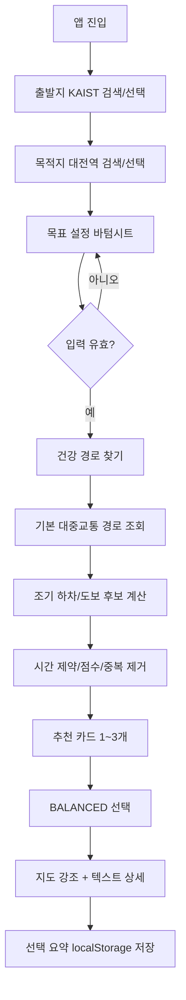

# CHIMap 정보 구조 및 화면 설계(IA)

> 문서 상태: NAVER 지도 + TAGO/Kakao 경로 UX 및 인증 fallback 반영
> 작성일: 2026-07-24
> 최종 수정: 2026-07-24
> 관련 문서: [`plan.md`](./plan.md), [`db_schema.md`](./db_schema.md)

## 1. 목적

이 문서는 CHIMap MVP의 화면 구조, 정보 우선순위, 사용자 흐름, 상태 전이, 접근성, 반응형 동작을 정의한다. 구현 시 화면 수를 불필요하게 늘리지 않고 **한 개의 지도 중심 화면 + 단계가 바뀌는 바텀시트**로 핵심 흐름을 완주하는 것이 목표다.

핵심 UX 원칙은 다음과 같다.

1. 사용자는 목적지를 바꾸지 않고 “얼마나 더 걸을지”를 선택한다.
2. 가장 중요한 판단 정보는 한 카드 안에서 비교할 수 있어야 한다.
3. 지도는 보조 시각화이며, 지도 없이도 경로를 이해할 수 있어야 한다.
4. 마감시간과 목표 달성 가능성을 과장하지 않는다.
5. 개발 fixture는 실제 조회처럼 보이지 않게 항상 데모로 명시한다.
6. 로딩, 부분 성공, 권한 거절, 외부 API 제한을 하나의 모호한 상태로 합치지 않는다.
7. 지도 화면은 NAVER, 장소·도보는 Kakao, 버스는 TAGO라는 역할을 UI에서 숨기지 않는다.

2026-07-24 공개 주소는 연결되어 있지만 현재 공개 이미지는 이전 mock
revision이다. NAVER SDK script는 200이나 인증 endpoint가 401이므로 실제
타일 대신 SVG fallback과 재시도 UI가 동작한다. 아래 IA의 live 상태는
저장소에 구현된 목표 상태이며 현재 공개 서버의 완료 상태를 뜻하지 않는다.

---

## 2. 대상 사용자와 핵심 과업

### 2.1 주요 사용자

**시간 제약이 있는 대중교통 이용자**

- 현재 위치에서 정해진 목적지로 이동해야 한다.
- 평소 이동에 걷기를 조금 더 보태고 싶다.
- 도착 마감시간은 지키고 싶다.
- 별도 운동 장소를 찾기보다 이동 자체를 활용하고 싶다.

### 2.2 사용자 핵심 질문

화면은 다음 질문에 순서대로 답해야 한다.

1. 어디에서 어디로 가는가?
2. 오늘 몇 걸음이 부족한가?
3. 몇 분까지 더 써도 되는가?
4. 어떤 경로가 가장 빠른가?
5. 어떤 경로가 시간과 걸음의 균형이 좋은가?
6. 목표에 가장 가까운 경로는 무엇인가?
7. 어디에서 내려서 얼마나 걸어야 하는가?
8. 조건 안에서 목표 달성이 안 된다면 최선은 무엇인가?

---

## 3. 전체 정보 구조

### 3.1 사이트 맵

MVP는 별도 URL 페이지 전환 없이 단일 앱 화면으로 구성한다.

```text
CHIMap App (/)
├─ 앱 헤더
│  ├─ 로고/서비스명
│  ├─ “지금 출발 기준” 안내
│  └─ 데모 데이터 배지/설명
├─ 지도 캔버스
│  ├─ 현재/출발 마커
│  ├─ 조기 하차·운동 시작 마커
│  ├─ 목적지 마커
│  ├─ 경로선
│  ├─ `NAVER 지도 + TAGO/DEMO 경로` 공급자 칩
│  ├─ 범례
│  └─ 지도 실패 폴백
├─ 검색 패널
│  ├─ 출발지 combobox
│  ├─ 목적지 combobox
│  ├─ 출발/도착 교환
│  ├─ 현재 위치
│  └─ 검색 결과 listbox
└─ 바텀시트/사이드 패널
   ├─ 최초 안내
   ├─ 운동 목표 입력
   │  └─ 고급 설정
   ├─ 추천 진행 단계
   ├─ 추천 결과
   │  ├─ baseline 요약
   │  ├─ warning/notice
   │  └─ 추천 카드 1~3개
   ├─ 선택 경로 상세
   │  ├─ 경로 요약
   │  ├─ 이동 단계
   │  └─ 계산 안내
   └─ 오류/빈 상태
```

### 3.2 논리 화면 ID

한 URL 안에서 다음 논리 화면 상태를 전환한다.

| ID | 이름 | 진입 조건 | 주요 행동 |
|---|---|---|---|
| S0 | 최초 상태 | 저장된 경로/검색 없음 | 장소 검색 시작 |
| S1 | 장소 입력 | 한 필드가 활성화됨 | 검색, 결과 선택, 교환, 현재 위치 |
| S2 | 목표 설정 | 출발/목적지 선택 완료 | 걸음/시간/보폭 입력, 추천 실행 |
| S3 | 추천 생성 | 추천 요청 진행 중 | 진행 단계 확인, 요청 취소/새 검색 |
| S4 | 추천 결과 | 추천 1~3개 성공 | 카드 비교/선택 |
| S5 | 경로 상세 | 카드 선택 | 단계 확인, 다른 카드 선택 |
| S6 | 결과 없음 | 유효 추천 0개 | 조건 수정, 기본 경로 안내 확인 |
| S7 | 복구 가능한 오류 | 지도/위치/일부 후보 실패 | 텍스트 사용 또는 재시도 |
| S8 | 차단 오류 | rate limit/upstream/baseline 실패 | 안내 확인, 잠시 후 재시도 |

---

## 4. 전역 레이아웃

### 4.1 모바일: 320px~767px

```text
┌────────────────────────────────┐
│ CHIMap       지금 출발  [DEMO] │  앱 헤더
├────────────────────────────────┤
│ ┌ 출발지 검색 ──────────────┐ │
│ │ 목적지 검색          ⇅  ◎ │ │  검색 오버레이
│ └────────────────────────────┘ │
│                                │
│             지도               │  남는 화면 대부분
│         (또는 폴백)            │
│                                │
│  [버스 ━][지하철 ━][도보 ┄]   │  축약 범례
├────────────────────────────────┤
│ ━━━━━ drag handle              │
│ 바텀시트 제목                  │
│ 상태/폼/추천 카드/상세          │
│                                │
│ [건강 경로 찾기]               │  sticky action
└────────────────────────────────┘
```

- 지도는 viewport의 배경 레이어를 차지한다.
- 검색 패널은 상단 safe area 아래에 고정한다.
- 바텀시트는 상태에 따라 `peek`, `half`, `expanded` 높이를 가진다.
- 핵심 CTA는 바텀시트 하단에 sticky로 둔다.
- 320px에서 교환/현재 위치 버튼은 아이콘으로 유지하되 `aria-label`을 제공한다.

### 4.2 태블릿/데스크톱: 768px 이상

```text
┌──────────────────────────────────────────────────────────┐
│ CHIMap · 목적지는 그대로, 가는 길은 더 건강하게  [DEMO] │
├──────────────────────┬───────────────────────────────────┤
│ 검색                 │                                   │
│ 목표 설정/상태       │               지도                │
│ 추천 카드            │                                   │
│ 선택 경로 상세       │                                   │
│                      │                        지도 범례   │
└──────────────────────┴───────────────────────────────────┘
```

- 왼쪽 패널: 360~440px, 스크롤 가능
- 오른쪽 지도: 나머지 폭
- 모바일의 바텀시트가 왼쪽 고정 패널로 전환된다.
- 추천 카드 선택 시 패널 스크롤 위치를 강제로 초기화하지 않는다.

---

## 5. 전역 시각 및 정보 원칙

### 5.1 색 역할

| 역할 | 권장 계열 | 사용 |
|---|---|---|
| 브랜드 | 딥 네이비/짙은 청록 | 헤더, 기본 CTA, 핵심 텍스트 |
| 운동 | 따뜻한 오렌지 | 추가 운동 구간, 운동 시작, 걸음 강조 |
| 목적지 | 녹색 | 목적지 마커, 완료 상태 |
| 버스 | 파랑 | 버스 선/아이콘/텍스트 라벨 |
| 지하철 | 보라 | 지하철 선/아이콘/텍스트 라벨 |
| 일반 도보 | 중립 회색 | 점선/도보 아이콘 |
| 경고 | 황토/주황 | 목표 미달, 부분 성공 |
| 오류 | 적색 | 입력 오류, API 차단 |
| 배경 | 아이보리/옅은 회색 | 앱 배경과 카드 배경 |

색만으로 구분하지 않고 선 패턴, 아이콘, `버스`, `지하철`, `도보`, `운동 도보` 텍스트를 함께 사용한다.

### 5.2 정보 우선순위

추천 카드 안의 우선순위:

1. 추천 타입과 추천 이유
2. 예상 도착시간
3. 추가시간과 예상 걸음
4. 이동 후 목표 달성률
5. 환승, 요금, 도보거리
6. 조건 경고

### 5.3 표현 원칙

- 사용: `예상 도착`, `예상 걸음`, `지금 출발 기준`
- 금지: `도착 보장`, `정확히 N걸음`, `반드시 목표 달성`
- demo: `데모 데이터`, `TAGO 및 카카오 서버 키를 연결하면 실제 장소와 버스 경로를 조회합니다.`
- 공급자: live `NAVER 지도 + TAGO 경로`, demo `NAVER 지도 + DEMO 경로`
- 목표 불가: `조건 안에서는 목표 걸음을 모두 채우기 어려워요. 가능한 경로 중 가장 가까운 선택입니다.`

---

## 6. 화면 상세

## 6.1 S0 — 최초 상태

### 목적

서비스 가치와 첫 행동을 즉시 이해하게 한다.

### 구성

- 헤더: `CHIMap`
- 슬로건: `목적지는 그대로, 가는 길은 더 건강하게.`
- 안내: `지금 출발하는 대중교통 경로를 기준으로 계산해요.`
- mock이면 demo badge와 설명
- 출발지/목적지 필드
- 초기 NAVER 지도 중심: 저장된 마지막 장소가 있으면 그 주변, 없으면 대전 기본 좌표
- 바텀시트 peek:
  - `어디로 이동하시나요?`
  - `출발지와 목적지를 먼저 선택해 주세요.`

### 행동

- 출발지 필드 포커스 → S1
- 목적지 필드 포커스 → S1
- 현재 위치 → 권한 흐름
- 저장된 last origin/destination이 모두 유효하면 자동 복구하되 추천은 자동 실행하지 않음

---

## 6.2 S1 — 장소 입력과 검색

### 검색 필드 계약

각 필드는 WAI-ARIA combobox 패턴을 사용한다.

- 연결된 `<label>`
- `role="combobox"`
- `aria-expanded`
- `aria-controls`
- `aria-activedescendant`
- 결과 목록 `role="listbox"`
- 결과 항목 `role="option"`

### 동작

1. 2자 미만: 요청하지 않고 `두 글자 이상 입력해 주세요.`
2. 2자 이상: 300ms 후 검색
3. 새 입력: 이전 요청 abort
4. 결과 기본 5개, 최대 10개
5. 현재 위치가 있으면 중심 좌표를 요청에 포함
6. `ArrowDown/ArrowUp`으로 이동
7. `Enter`로 선택
8. `Escape`로 목록 닫기

### 검색 결과 항목

- 장소명
- 도로명 주소 우선, 없으면 지번 주소
- 카테고리
- 같은 이름 구분에 필요한 최소 위치 정보

### 로딩/오류

- 검색 중: 필드 내부 spinner + `장소를 찾고 있어요`
- 결과 없음: `검색 결과가 없어요. 다른 이름이나 주소로 찾아보세요.`
- rate limit: `검색 요청이 많아요. 잠시 후 다시 시도해 주세요.`
- upstream: `장소 검색을 불러오지 못했어요. 입력한 장소는 유지됩니다.`

### 교환 버튼

- `aria-label="출발지와 목적지 바꾸기"`
- 두 장소와 필드 텍스트를 원자적으로 교환
- 추천 결과가 있으면 결과를 만료시키고 `조건이 바뀌어 다시 계산이 필요해요` 표시

### 현재 위치 버튼

- `aria-label="현재 위치를 출발지로 사용"`
- 성공: 현재 좌표를 검색 중심/출발 위치로 사용하고 `현재 위치`라는 임시 Place 구성
- 거절: 비차단 안내 `위치 권한을 허용하지 않아도 장소를 직접 검색할 수 있어요.`
- timeout/미지원: 수동 검색으로 계속 진행

---

## 6.3 S2 — 운동 목표 설정

### 진입 조건

- 출발지와 목적지가 모두 선택됨
- 두 지점 직선거리 50m 이상

### 기본값

| 필드 | 기본값 | 범위 |
|---|---:|---:|
| 현재 걸음 수 | 0 | 0~100,000 |
| 하루 목표 걸음 수 | 저장값 또는 8,000 | 1~100,000 |
| 도착 마감시간 | 현재 + 60분 | 현재보다 미래 |
| 최대 추가시간 | 저장값 또는 20분 | 0~120분 |
| 보폭 | 저장값 또는 0.7m | 0.3~1.2m |
| 안전 여유시간 | 저장값 또는 3분 | 0~15분 |

### 필드 UI

- 현재/목표 걸음: `inputmode="numeric"`
- 마감시간: 모바일 친화적 datetime 입력, KST 표시
- 추가시간: 숫자 입력 + 선택적 slider
- 보폭: 숫자 입력 + 자주 쓰는 값 quick option
- 안전 여유: `고급 설정` disclosure 안에 배치
- 모든 필드에 label, 단위, 오류 문구 연결

### 실시간 요약

목표 미달:

```text
오늘 2,800걸음이 남았어요.
보폭 0.7m 기준 약 1.96km예요.
```

목표 달성:

```text
오늘 목표를 이미 달성했어요 🎉
추가 걷기를 강요하지 않고 가장 빠른 경로를 우선할게요.
```

### 마감시간 처리

- 과거/현재: submit 차단
- 현재부터 6시간 초과: MVP에서는 submit을 차단하는 대신 `현재 시점 경로를 기준으로 한 추정이에요` 경고를 명확히 표시하거나 구현 선택에 따라 6시간으로 제한
- 초기 구현 결정: **6시간까지 허용하고 초과 입력은 validation 오류로 처리**
- 안전 여유 적용 결과가 이미 현재보다 과거면 submit 차단

### CTA

`건강 경로 찾기`

비활성 조건:

- 장소 미선택
- 입력 validation 실패
- 출발/도착이 50m 미만
- 요청 진행 중

submit 시 S3로 전환한다.

---

## 6.4 S3 — 추천 생성 진행

단일 `로딩 중` 문구 대신 서버 처리 개념에 맞춘 단계 메시지를 순차 표시한다.

| 단계 | UI 문구 | 시각 요소 |
|---|---|---|
| L1 | `입력 조건을 확인하고 있어요` | 체크 아이콘 |
| L2 | `가장 빠른 기본 경로를 찾고 있어요` | 대중교통 아이콘 |
| L3 | `조금 더 걸을 수 있는 하차 지점을 살펴보고 있어요` | 오렌지 걷기 아이콘 |
| L4 | `시간과 걸음 수를 비교하고 있어요` | 비교 아이콘 |
| L5 | `추천 경로를 정리하고 있어요` | 카드 skeleton |

### 동작 원칙

- 실제 백엔드가 세부 progress stream을 제공하지 않는 MVP에서는 시간 기반으로 L1→L4를 안내하되, 완료 후 즉시 결과로 전환한다.
- `aria-live="polite"`로 단계 변경을 알린다.
- 사용자가 장소/조건을 변경하면 기존 요청을 취소하고 결과를 폐기한다.
- 중복 submit을 막는다.
- 15초가 가까워지면 `외부 경로 조회가 평소보다 오래 걸리고 있어요`를 표시한다.

---

## 6.5 S4 — 추천 결과

### 상단 요약

```text
KAIST → 대전역
지금 출발 · 기본 경로 약 40분 · 기본 도보 430m
```

- mock badge
- 예상값 안내
- warning이 있으면 카드 위 notice stack

### 추천 카드 구조

```text
┌────────────────────────────────┐
│ [균형 경로] 추천               │
│ 시간과 부족한 걸음을 고르게…   │
│                                │
│ 예상 도착  17:42               │
│ +12분       약 2,430걸음       │
│                                │
│ 이동 후 목표 달성률 95%        │
│ ███████████████████░           │
│                                │
│ 도보 1.7km · 환승 1회 · 1,550원│
│ [경로 자세히 보기]             │
└────────────────────────────────┘
```

### 카드 타입

| 타입 | 한국어 라벨 | 기본 이유 |
|---|---|---|
| FAST | 빠른 경로 | `마감시간을 지키면서 가장 빠르게 도착해요.` |
| BALANCED | 균형 경로 | `추가시간과 부족한 걸음을 균형 있게 맞췄어요.` |
| GOAL | 목표 달성 경로 | `남은 걸음 수에 가장 가까운 경로예요.` |

### 표시 규칙

- `extraMinutes=0`이면 `기본 경로와 동일`
- 요금 미제공이면 `요금 정보 없음`, 0원으로 표시하지 않음
- 환승 0은 `환승 없음`
- 목표율은 최대 100%로 표시
- 예상 총 걸음은 100%를 넘더라도 실제 계산값 유지
- 세부에서 부족분 충족률을 별도 표시 가능
- 결과가 1~2개면 빈 카드 자리를 만들지 않음

### 목표 달성 불가

해당 카드 또는 결과 상단에 다음 경고를 표시한다.

```text
설정한 마감시간과 추가시간 안에서는 오늘 목표를 모두 채우기 어려워요.
조건을 지키는 경로 중 남은 걸음에 가장 가까운 선택이에요.
```

### 카드 선택

1. 선택된 카드에 명확한 border와 `선택됨` 텍스트
2. 지도에서 해당 route 강조
3. 다른 route opacity 감소
4. route 전체 bounds 맞춤
5. S5 상세 영역 열기
6. `StoredTripV1` 저장

선택 효과는 색만으로 표현하지 않는다.

---

## 6.6 S5 — 선택 경로 상세

### 상세 헤더

- 추천 타입
- 출발지 → 목적지
- 예상 도착
- 예상 걸음
- 닫기/축소 버튼

### 이동 단계

각 `RouteLeg`를 순서대로 표시한다.

```text
1. 일반 도보 · 6분 · 430m
   KAIST 정문에서 충남대학교 정류장까지 이동

2. 버스 104 · 22분 · 정류장 8개
   충남대학교 → 정부청사역

3. 지하철 1호선 · 7분 · 4개 역
   정부청사역 → 중앙로역

4. 운동 도보 · 18분 · 1.4km
   중앙로역에서 대전역까지 걸어요
```

### leg 표시 규칙

- mode icon + mode 텍스트
- name이 있으면 노선명
- guidance가 있으면 우선 사용
- distance/time
- stops가 있으면 출발/도착과 개수 요약
- 운동 구간은 `추가 운동` badge와 오렌지 굵은 선
- 좌표가 없어도 텍스트 leg는 표시

### 계산 안내

접을 수 있는 `예상값은 어떻게 계산했나요?`

- 보폭 기반 걸음 환산
- 지금 출발 기준
- 실제 운행 지연/신호/걷는 속도에 따라 차이
- 안전 여유시간 적용

---

## 6.7 S6 — 결과 없음/마감시간 내 경로 없음

### A. 대중교통 경로 없음

```text
대중교통 경로를 찾지 못했어요.
출발지와 목적지를 다시 확인하거나 다른 장소를 선택해 주세요.
```

행동:

- 장소 수정
- 교환
- 다시 검색

### B. 마감시간 내 운동 경로 없음

```text
설정한 시간 안에 도착할 수 있는 운동 경로를 찾지 못했어요.
마감시간 또는 최대 추가시간을 늘려 보세요.
```

가능하면 baseline이 deadline을 만족하는지 구분한다.

- baseline 가능, 운동 후보 불가: 기본 경로 요약 제공
- baseline도 불가: 추천 카드를 표시하지 않음

행동:

- `조건 수정하기`
- 빠른 기본 경로가 유효하면 `기본 경로 보기`

### C. 중복 제거 후 1개뿐

오류가 아니라 정보 notice:

```text
조건을 만족하면서 충분히 다른 경로가 1개뿐이에요.
같은 경로를 반복해서 보여드리지 않았어요.
```

---

## 6.8 S7 — 복구 가능한 오류

### 지도 SDK 실패

지도 영역:

```text
네이버 지도를 불러오지 못했어요.
아래 추천 카드와 텍스트 이동 단계는 계속 사용할 수 있어요.
```

- `다시 불러오기`
- 추천 결과/상세는 유지
- 지도 영역 최소 높이 유지
- TAGO/Kakao 정규화 경로 좌표가 있으면 동일 구간 스타일의 SVG 미리보기를 표시

키 부재와 로딩은 실패와 구분한다.

| 상태 | 지도 영역 문구 | 행동 |
|---|---|---|
| NAVER Client ID 없음 | `네이버 지도 키 없이 경로선 미리보기로 표시 중` | 폴백 유지 |
| SDK 로딩 | `네이버 지도를 불러오는 중` | 12초까지 대기 |
| SDK 오류/timeout/auth 실패 | `네이버 지도를 불러오지 못했어요` | 다시 불러오기 |
| SDK 준비 | 스크린리더에 `네이버 지도가 준비됐어요. 경로 계산 데이터는 TAGO를 사용합니다.` | 지도 사용 |

### 현재 위치 권한 거절

검색 패널 아래 비차단 notice:

```text
위치 권한을 사용하지 않았어요.
출발지를 직접 검색하면 계속 이용할 수 있어요.
```

### 일부 후보 실패

결과 상단:

```text
일부 운동 경로를 확인하지 못했지만,
검증된 경로 N개를 먼저 보여드려요.
```

성공 결과를 숨기지 않는다.

---

## 6.9 S8 — 차단 오류

| 오류 | 제목 | 본문 | 행동 |
|---|---|---|---|
| 앱 rate limit | 요청이 너무 많아요 | `잠시 후 다시 시도해 주세요.` | 조건 유지, 재시도 |
| Kakao/TAGO quota/rate | 경로 조회 사용량이 많아요 | `외부 경로 서비스 제한으로 지금은 조회하기 어려워요.` | 잠시 후 재시도 |
| upstream timeout | 경로 조회가 지연되고 있어요 | `조건은 그대로 저장했어요.` | 재시도 |
| upstream error | 경로를 불러오지 못했어요 | `외부 지도 서비스 응답을 확인하지 못했어요.` | 재시도 |
| internal | 문제가 발생했어요 | request ID 제공 | 다시 시도 |

raw Kakao/TAGO 메시지, stack, 키는 절대 표시하지 않는다.

---

## 7. 주요 사용자 흐름

## 7.1 정상 흐름: KAIST → 대전역



### 정상 흐름 완료 기준

- 입력 손실 없음
- 단계별 로딩 문구 확인
- FAST/BALANCED/GOAL이 서로 다른 후보일 때만 모두 표시
- 선택 후 지도와 상세가 같은 route를 가리킴
- 새로고침 후 선호 설정 복구

## 7.2 목표 이미 달성

```text
현재 걸음 >= 목표 걸음
→ 축하 안내
→ 추가 걷기 거리 목표 0
→ FAST 우선 추천
→ BALANCED/GOAL은 생략하거나 “이미 달성” 맥락으로만 제공
```

불필요한 운동을 유도하는 카피를 사용하지 않는다.

## 7.3 마감시간이 촉박함

```text
추천 요청
→ effective deadline 계산
→ 모든 운동 후보 탈락
→ baseline은 유효한가?
   ├─ 예: 기본 경로 요약 + 운동 경로 없음 안내
   └─ 아니오: 마감시간 내 경로 없음 + 조건 수정
```

## 7.4 결과 2개

```text
후보 생성
→ 제약 필터
→ 중복 제거
→ 유효 후보 2개
→ 2개만 렌더
→ “충분히 다른 경로가 2개” notice
```

## 7.5 지도 실패

```text
추천 API 성공
→ NAVER 지도 SDK load 실패
→ 추천 카드/상세 정상 렌더
→ TAGO/Kakao 정규화 좌표 기반 SVG 폴백
→ 카드 선택과 localStorage 저장 유지
```

---

## 8. 상태 모델

### 8.1 앱 상태 머신

```text
IDLE
 ├─ focus place ──────────────> SEARCHING_PLACE
 └─ restored valid places ────> CONFIGURING

SEARCHING_PLACE
 ├─ select both places ───────> CONFIGURING
 ├─ select one place ─────────> IDLE/PARTIAL
 └─ cancel ───────────────────> previous

CONFIGURING
 ├─ valid submit ─────────────> VALIDATING
 └─ place change ─────────────> SEARCHING_PLACE

VALIDATING
 ├─ valid ────────────────────> FETCHING_BASELINE
 └─ invalid ──────────────────> CONFIGURING

FETCHING_BASELINE
 ├─ success ──────────────────> GENERATING_CANDIDATES
 └─ failure ──────────────────> BLOCKING_ERROR

GENERATING_CANDIDATES
 ├─ candidates ───────────────> RANKING
 ├─ partial ──────────────────> RANKING_WITH_WARNING
 └─ none ─────────────────────> EMPTY

RANKING
 ├─ 1..3 recommendations ─────> RESULTS
 └─ no valid deadline route ──> DEADLINE_EMPTY

RESULTS
 ├─ select route ─────────────> DETAILS
 ├─ edit conditions ──────────> CONFIGURING
 └─ change place ─────────────> SEARCHING_PLACE

DETAILS
 ├─ select other route ───────> DETAILS
 ├─ collapse ─────────────────> RESULTS
 └─ edit ─────────────────────> CONFIGURING
```

### 8.2 서버 상태와 UI 상태 매핑

| 서버/네트워크 상태 | UI 상태 | 결과 유지 |
|---|---|---|
| places pending | 검색 중 | 선택된 기존 장소 유지 |
| places aborted | 새 검색 중 | 오류 표시 안 함 |
| recommendation pending | S3 | 이전 결과는 흐리게 하거나 제거 |
| recommendation success | S4 | 새 결과 |
| success + warning | S4/S7 | 성공 결과 유지 |
| 400 | S2 validation | 입력 유지 |
| 404 no route | S6 | 조건 유지 |
| 429 | S8 | 조건 유지 |
| 502/504 | S8 | 조건 유지 |
| NAVER map SDK/auth error | S7 map only | 추천 결과 모두 유지 |
| Kakao/TAGO recommendation error | S8 | NAVER 기본 지도는 유지 |

---

## 9. 컴포넌트 정보 구조

```text
AppShell
├─ AppHeader
│  ├─ Brand
│  ├─ DepartureModeNotice
│  └─ DemoBadge
├─ MapRegion
│  ├─ NaverMap
│  ├─ RoutePolylineLayer
│  ├─ MarkerLayer
│  ├─ ProviderChip
│  ├─ MapLegend
│  └─ MapFallback
├─ PlaceSearchPanel
│  ├─ PlaceCombobox(origin)
│  ├─ SwapPlacesButton
│  ├─ PlaceCombobox(destination)
│  └─ CurrentLocationButton
└─ TripPanel
   ├─ InitialPrompt
   ├─ GoalForm
   │  ├─ StepSummary
   │  ├─ CurrentStepsField
   │  ├─ GoalStepsField
   │  ├─ DeadlineField
   │  ├─ ExtraMinutesField
   │  ├─ StrideField
   │  └─ AdvancedSettings
   ├─ RecommendationProgress
   ├─ ResultSummary
   ├─ WarningStack
   ├─ RecommendationList
   │  └─ RecommendationCard[]
   ├─ RouteDetails
   │  └─ RouteLegItem[]
   └─ StateMessage
```

### 9.1 상태 소유권

| 상태 | 소유 |
|---|---|
| 장소 검색 응답 | TanStack Query |
| 추천 응답 | TanStack Query |
| 검색어/활성 결과 인덱스 | PlaceCombobox local state |
| origin/destination/폼 값 | Zustand trip draft |
| 선택 route ID | Zustand |
| NAVER map SDK ready/error | MapRegion local state |
| TAGO route provider demo/live | health/recommendation response |
| 저장된 선호/last trip | storage adapter |

---

## 10. 입력 검증과 오류 문구

| 필드 | 조건 | 오류 문구 |
|---|---|---|
| 장소 검색어 | 2자 이상 | `두 글자 이상 입력해 주세요.` |
| 출발지/목적지 | 선택 필요 | `출발지와 목적지를 선택해 주세요.` |
| 두 장소 거리 | 50m 이상 | `출발지와 목적지가 너무 가까워요.` |
| 현재 걸음 | 0~100,000 | `0에서 100,000 사이로 입력해 주세요.` |
| 목표 걸음 | 1~100,000 | `1에서 100,000 사이로 입력해 주세요.` |
| 마감시간 | 현재보다 미래 | `현재보다 이후 시간을 선택해 주세요.` |
| 마감시간 | 6시간 이내 | `지금부터 6시간 이내로 선택해 주세요.` |
| 추가시간 | 0~120 | `0에서 120분 사이로 입력해 주세요.` |
| 보폭 | 0.3~1.2 | `0.3m에서 1.2m 사이로 입력해 주세요.` |
| 안전 여유 | 0~15 | `0에서 15분 사이로 입력해 주세요.` |

- 오류는 필드 바로 아래에 표시한다.
- `aria-describedby`로 오류와 도움말을 연결한다.
- submit 후 첫 오류 필드로 포커스를 이동한다.
- 프론트 오류와 서버 400 오류를 동일한 공유 계약 기준으로 매핑한다.

---

## 11. 지도 정보 구조

### 11.0 공급자와 데이터 흐름

| 화면 요소/동작 | 공급자 | 데이터 경계 |
|---|---|---|
| 지도 타일, 이동, 확대/축소, 축척, 저작권 | NAVER Web Dynamic Map | 브라우저 `ncpKeyId` |
| 장소 검색 | Kakao REST | API가 `Place`로 정규화 |
| 도보 경로 | Kakao REST | API가 `WALK RouteLeg`로 정규화 |
| 버스 정류장·노선·도착·차량 | TAGO OpenAPI | API가 `BUS RouteLeg`와 차량 위치로 정규화 |
| 경로선/마커 | NAVER Polyline/Marker | Kakao/TAGO WGS84 `{lng,lat}`를 `LatLng(lat,lng)`로 변환 |
| SDK 실패 미리보기 | CHIMap SVG | 같은 `RouteLeg.coordinates` |

사용자에게 보이는 지도 위에는 live에서 `NAVER 지도 + TAGO 경로`, demo에서
`NAVER 지도 + DEMO 경로` 칩을 둔다.
NAVER가 경로를 계산했거나 Kakao/TAGO가 지도 타일을 제공한 것처럼 표현하지 않는다.
NAVER의 로고와 지도 데이터 저작권 컨트롤은 가리지 않는다.

### 11.1 선 스타일

| 구간 | 색 | 패턴 | 두께 | 텍스트 라벨 |
|---|---|---|---:|---|
| 일반 도보 | 회색 | 짧은 점선 | 5px | `일반 도보` |
| 버스 | 파랑 | 실선 | 6px | `버스 {노선}` |
| 지하철 | 보라 | 실선 | 6px | `지하철 {노선}` |
| 추가 운동 | 오렌지 | 굵은 실선 | 8px | `추가 운동 도보` |

### 11.2 마커

| 지점 | 모양/색 | 대체 정보 |
|---|---|---|
| 출발지 | 파란 HTML pill + `출발` | 검색 패널과 상세에 이름 |
| 운동 시작 | 오렌지 HTML pill + `운동 시작` | 해당 leg 제목 |
| 목적지 | 녹색 HTML pill + `도착` | 검색 패널과 상세에 이름 |
| 선택 경로 운행 차량 | 노선번호가 있는 차량 마커 | `버스 {노선번호}`와 선택적 차량번호 |

### 11.3 카드-지도 동기화

- 카드 select: route 확정 강조, bounds 조정
- 비교 경로선은 시각 보조이며 직접 클릭 대상으로 만들지 않음
- 경로 선택의 접근 가능한 조작점은 추천 카드 버튼으로 단일화
- 지도와 카드 사이 동일 `recommendation.id` 사용
- 선택 카드의 bus leg만 차량 위치를 조회하고, visible 탭에서 10초마다
  갱신한다. background 탭에서는 polling을 멈춘다.
- 위치 API가 비었거나 실패하면 경로는 유지하고 상세에 실시간 차량 위치를
  제공하지 못한다는 비차단 안내를 표시한다.
- bounds 계산 시 모든 leg의 유효 좌표만 사용
- 좌표가 비면 지도 동작을 생략하고 상세는 유지

### 11.4 지도 뷰포트와 생명주기

- 최초 장소가 없으면 대전을 중심으로 zoom 14에서 시작한다.
- 한 점만 있으면 해당 점을 중심으로 zoom 15를 적용한다.
- 경로가 있으면 선택 경로의 모든 좌표와 출발·도착점을 경계에 포함한다.
- 모바일 NAVER 지도 DOM은 55vh 바텀시트 위의 실제 가시 높이까지만 두어
  NAVER 로고/저작권 컨트롤이 시트에 가려지지 않게 한다.
- `fitBounds`는 상단 검색 패널 여백과 `maxZoom=16`으로 과확대를 막는다.
- 선택 경로는 opacity 0.95/z-index 20, 비교 경로는 opacity 0.2/z-index 10.
- 경로/선택 변경 전 기존 overlay를 제거하고, 언마운트 시 Map까지 파기한다.
- 경로 정보의 접근 가능한 원본은 지도 DOM이 아니라 추천 카드와 텍스트
  이동 단계다.

---

## 12. 바텀시트 동작

| 상태 | 모바일 기본 높이 | 스크롤 |
|---|---|---|
| S0 최초 | peek | 없음 |
| S1 검색 | half | 결과 내부 |
| S2 설정 | half | 폼 내부 |
| S3 로딩 | half | 없음 |
| S4 결과 | half | 카드 목록 |
| S5 상세 | expanded | 상세 전체 |
| 오류 | half | 필요 시 |

- drag가 없어도 버튼/제목으로 expand/collapse 가능해야 한다.
- keyboard 사용 시 focus가 가려지지 않도록 sheet를 확장한다.
- reduced motion에서는 snap animation을 최소화한다.
- sheet가 modal이 아닌 상태에서는 지도/검색 포커스를 가두지 않는다.
- 상세를 modal처럼 확장한다면 올바른 focus trap과 닫기 복귀를 제공한다.

---

## 13. 접근성 기준

### 13.1 필수 구현

- 모든 input에 보이는 label
- 아이콘 버튼에 명확한 `aria-label`
- 최소 터치 영역 약 44×44px
- 키보드 검색 결과 탐색
- `:focus-visible` 유지
- 상태 변경은 `aria-live`로 공지
- 진행 spinner에 텍스트 대체
- 색 + 아이콘 + 텍스트 + 선 패턴 조합
- 지도와 동일한 정보를 텍스트 단계로 제공
- progress bar에 접근 가능한 이름과 수치
- `<button>`과 링크의 역할을 바꾸지 않음

### 13.2 포커스 순서

1. skip link: `검색과 경로 설정으로 건너뛰기`
2. 로고/모드 안내
3. 출발지
4. 목적지
5. 교환
6. 현재 위치
7. 목표 폼
8. CTA
9. 결과 notice
10. 추천 카드
11. 상세 단계
12. 지도 범례/다시 불러오기

시각 배치와 DOM 순서를 크게 다르게 만들지 않는다.

### 13.3 모션

첫 세션 랜딩은 motorsport/editorial 계열의 빠른 리빌 감각을 참고하되
CHIMap의 경로 탐색 의미로 재구성한다.

- 전체 길이 3초: 2.2초에 본문을 먼저 reveal하고 0.8초 curtain으로 종료
- 오렌지→크림 color shift와 상·하단 원형 orbit
- 네 개 contour path의 0.2~0.56초 stagger draw
- 나침반 회전/scale, `CHI`/`MAP` split wordmark의 staggered vertical reveal
- 출발→도착 SVG route draw, stop pop, 하단 progress fill
- 본문은 header, map, search panel, trip sheet 순서로 0.62~0.9초 enter
- `인트로 건너뛰기`는 즉시 reveal/complete하고 세션에 완료 상태 저장
- `chimap:intro-seen-v1`은 `sessionStorage`라 새 브라우저 세션에서만 다시
  재생되며 제품 선호 localStorage와 섞지 않음

`prefers-reduced-motion: reduce`일 때:

- 인트로 자체를 시작하지 않음
- 바텀시트 spring 제거
- route 강조 transition 최소화
- skeleton shimmer 정지 또는 단순 pulse
- 지도 bounds 애니메이션 대신 즉시 이동

실행 중 OS 설정이 reduce로 바뀌어도 즉시 skip한다. CSS 전역 안전망은
animation/transition을 0.01ms·1회로 제한한다.

---

## 14. 반응형 검증 행렬

| viewport | 기대 결과 |
|---|---|
| 320×568 | 필드/CTA 잘림 없음, 카드 가로 스크롤 없음 |
| 390×844 | 기준 모바일 레이아웃, 지도와 half sheet 동시 확인 |
| 430×932 | 큰 모바일 safe area 반영 |
| 768×1024 | 좌측 패널 + 지도 분할 시작 |
| 1024×768 | 패널 고정, 상세 스크롤 독립 |
| 1440×900 | 지도 과확대 방지, 패널 최대 폭 유지 |

모든 viewport에서:

- 추천 핵심 수치가 첫 카드 화면에 보인다.
- 버튼 텍스트가 잘리지 않는다.
- 지도 failure fallback 높이가 0이 되지 않는다.
- zoom 200%에서 주요 기능을 쓸 수 있다.

---

## 15. 로컬 저장 UX

스키마는 [`db_schema.md`](./db_schema.md)를 따른다.

### 15.1 자동 저장

- 목표 걸음, 보폭, 추가시간, 안전 여유
- 마지막 출발지/목적지
- 사용자가 선택한 추천 타입과 예상 요약

### 15.2 저장하지 않는 항목

- 현재 걸음 수
- deadline
- 전체 route coordinates
- 검색어 히스토리
- Kakao/TAGO raw 응답

### 15.3 복구

- 앱 시작 시 preference를 safe parse
- 잘못된 버전/JSON이면 해당 데이터만 무시하고 기본값 사용
- 마지막 장소는 유효한 Place일 때만 복원
- 마지막 trip은 “지난 선택” 표시용이며 실제 경로를 복원하거나 재사용하지 않음
- 저장 실패(private mode/quota)는 비차단 처리

---

## 16. 데모 시나리오 진입

mock 모드에서 장소와 조건 조합으로 다음 상태를 재현할 수 있어야 한다.

| 시나리오 | 진입 | 기대 UI |
|---|---|---|
| 정상 | KAIST → 대전역 | 서로 다른 추천 최대 3개 |
| 다른 목적지 | KAIST → 유성온천역 | 짧은 이동에 맞는 결과 |
| 목표 달성 | 현재 ≥ 목표 | 축하 + FAST 우선 |
| 촉박한 마감 | deadline을 매우 짧게 | S6 deadline 상태 |
| 2개 후보 | fixture 조건/목적지 | 카드 2개 + 이유 notice |
| 부분 실패 | fixture 조건/목적지 | 성공 카드 + partial warning |

개발자 전용 제어가 필요하면 production DOM에 숨은 마법 값을 넣기보다 fixture의 명시적 시나리오 ID 또는 테스트 주입으로 구현한다.

---

## 17. 문구 사전

### 공통

- 모드: `지금 출발 기준`
- 추정 안내: `걸음 수와 도착시간은 예상값입니다.`
- 데모: `데모 데이터`
- 데모 설명: `TAGO 및 카카오 서버 키를 연결하면 실제 장소와 버스 경로를 조회합니다.`
- 공급자: `NAVER 지도 + TAGO 경로` 또는 `NAVER 지도 + DEMO 경로`

### 상태

- 기본 조회: `가장 빠른 기본 경로를 찾고 있어요`
- 후보 계산: `조금 더 걸을 수 있는 경로를 계산하고 있어요`
- 부분 성공: `일부 경로는 확인하지 못했지만 검증된 결과를 보여드려요`
- 목표 달성: `오늘 목표를 이미 달성했어요`
- 목표 미달: `조건 안에서는 목표 걸음을 모두 채우기 어려워요`
- 지도 키 없음: `네이버 지도 키 없이 경로선 미리보기로 표시 중`
- 지도 로딩: `네이버 지도를 불러오는 중`
- 지도 오류: `네이버 지도를 불러오지 못했어요`

### CTA

- 초기: `건강 경로 찾기`
- 수정: `조건 다시 계산하기`
- 오류: `다시 시도`
- 상세: `경로 자세히 보기`
- 폴백: `텍스트 경로 보기`

---

## 18. 요구사항 추적

| plan 요구사항 | IA 반영 위치 |
|---|---|
| FR-01 장소 검색 | 6.2, 10 |
| FR-02 목표 입력 | 6.3 |
| FR-03 baseline | 6.4, 6.5 |
| FR-04 조기 하차 | 6.4, 6.6, 11 |
| FR-05 POI 폴백 | 사용자에게는 검증된 운동 구간으로 표현 |
| FR-06 시간 제약 | 6.3, 6.7 |
| FR-07 추천 타입 | 6.5 |
| FR-08 중복 제거 | 6.5, 6.7 |
| FR-09 공급자 분리 지도 | 6.8, 7.5, 8.2, 9, 11 |
| FR-10 텍스트 상세 | 6.6 |
| FR-11 데모 모드 | 6.1, 16, 17 |
| FR-12 로컬 저장 | 15 |
| FR-13 상태 화면 | 3.2, 6.4~6.9, 8 |
| FR-14 현재 위치 | 6.2 |
| FR-15 mock/live | 5.3, 17 |
| NFR-01 반응형 | 4, 14 |
| NFR-02 접근성 | 6.2, 10, 13 |
| NFR-07 개인정보 | 15 |
| NFR-08 복원력 | 6.7~6.9 |

---

## 19. IA 인수 체크리스트

### 구조

- [ ] 한 화면에서 검색 → 설정 → 추천 → 상세 흐름 완주
- [ ] 모바일 바텀시트와 데스크톱 분할 패널
- [ ] 1~3개 결과를 자연스럽게 처리
- [ ] 지도와 카드가 동일 route 선택 상태 공유
- [ ] `NAVER 지도 + TAGO/DEMO 경로` 출처가 실제 모드와 일치

### 상태

- [ ] 최초
- [ ] 장소 검색 중/없음/오류
- [ ] 추천 validation
- [ ] 기본 경로 조회
- [ ] 운동 후보 계산
- [ ] 추천 결과
- [ ] 마감시간 내 경로 없음
- [ ] 일부 후보 성공
- [ ] 외부 rate/quota
- [ ] 지도 실패
- [ ] NAVER 키 없음/로딩/실패가 각각 구분됨
- [ ] 위치 권한 거절
- [ ] mock
- [ ] 목표 이미 달성

### 접근성/반응형

- [ ] 모든 field label
- [ ] combobox 키보드 동작
- [ ] 아이콘 aria-label
- [ ] focus-visible
- [ ] 44px touch target
- [ ] 비색상 정보 구분
- [ ] 텍스트 route steps
- [ ] reduced motion
- [ ] 320/390/768/1024 검증

### 표현

- [ ] “예상”, “지금 출발” 사용
- [ ] 도착/걸음 보장 표현 없음
- [ ] demo 표시가 항상 보임
- [ ] 목표 불가/부분 실패/결과 부족 이유 표시
