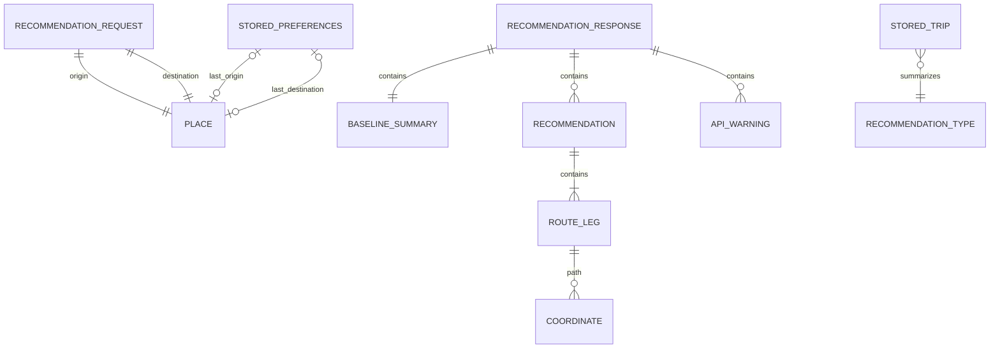
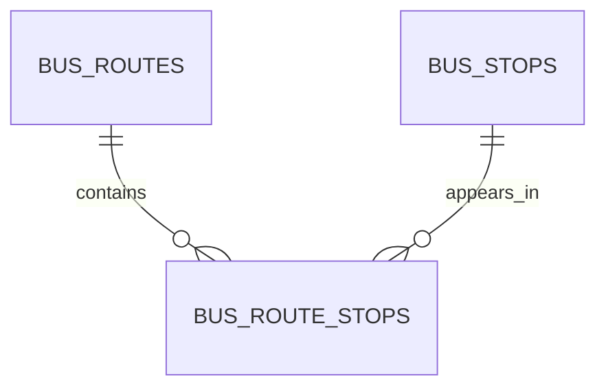

# CHIMap MVP 데이터 및 영속성 스키마

> 문서 상태: TAGO 버스 정적 데이터 저장소 반영
> 작성일: 2026-07-24
> 최종 수정: 2026-07-24
> 관련 문서: [`plan.md`](./plan.md), [`IA.md`](./IA.md)

## 1. 핵심 결정: 버스 정적 데이터에만 SQLite를 사용한다

초기 무DB 결정은 전국 정류장 파일과 TAGO route-stop 관계를 수용하기 위해
변경되었다. Node 24 내장 SQLite와 SQL migration을 사용하며 별도 ORM,
PostgreSQL/PostGIS, Supabase, Redis는 도입하지 않는다.

- `bus_stops`: CSV `source_stop_no`와 TAGO `node_id`/`city_code` 분리
- `bus_routes`: `(city_code, route_id)` unique
- `bus_route_stops`: 노선 순서와 방향 관계
- 실시간 도착/차량 위치: 영구 저장하지 않고 TTL 메모리 캐시만 사용
- 사용자 설정/마지막 선택: 기존처럼 브라우저 localStorage 사용
- 사용자 이동 이력, 원본 TAGO/Kakao 응답: 저장하지 않음

실제 migration은 `apps/api/src/transit/migrations.ts`, import와 운영 설명은
`docs/tago-transit-integration.md`를 기준으로 한다. Kakao는 장소·도보만,
TAGO는 버스 대중교통만 담당한다. 아래의 과거 설계 예시는 이 현재 공급자
분리를 전제로 읽고, 공유 `NormalizedRoute`/추천 점수 계약은 유지한다.

---

## 2. 데이터 저장소 개요

| 저장 위치 | 데이터 | 수명 | 공유 범위 | 상한/정리 |
|---|---|---|---|---|
| 브라우저 localStorage | 선호 설정 | 버전이 맞는 동안 | 해당 브라우저 origin | 작은 JSON 1건 |
| 브라우저 localStorage | 마지막 선택 경로 요약 | 다음 선택까지 | 해당 브라우저 origin | 작은 JSON 1건 |
| API LRU 메모리 | 장소/정류장/경로/추천 | 60초~6시간 | 한 API 인스턴스 | 총 128MB |
| SQLite | 전국 정류장/버스 노선/route-stop | 운영자가 갱신할 때까지 | 한 DB 파일 | upsert/migration |
| API single-flight map | 진행 중 동일 요청 Promise | 요청 완료까지 | 한 API 인스턴스 | 완료/실패 즉시 제거 |
| 저장소 fixture | 익명 mock/계약 샘플 | 코드 버전 동안 | 개발/테스트 | 최소 정제 샘플 |
| 서버 환경변수 | Kakao/TAGO 키·모드·운영 설정 | 프로세스 수명 | API 런타임 | 로그/응답 금지 |
| 웹 빌드 환경변수 | NAVER Maps Client ID | 배포 번들 수명 | 브라우저 공개 경계 | 값의 UI/로그 출력 금지 |
| 구조화 로그 | 지연/개수/오류 코드 | 운영 정책에 따름 | 운영 로그 시스템 | 민감 데이터 금지 |

### 2.1 데이터 소유권

| 데이터 | Source of truth |
|---|---|
| Place/Route 공개 타입 | `packages/contracts` Zod 스키마 |
| Kakao/TAGO raw 응답 | API provider/transit client 내부 parser |
| NAVER 지도 SDK 객체 | 웹 `MapView` 어댑터 |
| 추천 계산 | API recommendation engine |
| 현재 폼 draft | 웹 Zustand store |
| 서버 응답 상태 | TanStack Query cache |
| 사용자 기본값 | localStorage preference |
| 현재 지도 표시 | NAVER basemap + 선택 recommendation의 TAGO/demo route legs |

---

## 3. 논리 데이터 모델

### 3.1 관계



이 다이어그램은 런타임 객체 관계이며 데이터베이스 테이블을 뜻하지 않는다.

### 3.2 좌표 불변식

```ts
type Coordinate = {
  lng: number;
  lat: number;
};
```

- 모든 내부/공개/API 좌표는 `{lng, lat}`.
- `lng`: -180 이상 180 이하.
- `lat`: -90 이상 90 이하.
- 숫자는 finite여야 한다.
- Kakao raw `[x, y]`와 TAGO 위·경도 문자열은 provider 경계에서
  `{lng, lat}`로 변환한다.
- NAVER Maps SDK에 전달할 때만 `new naver.maps.LatLng(lat, lng)` 순서를 쓴다.
- Kakao 도보와 TAGO 버스 경로는 WGS84 정규화 후에만 NAVER overlay로
  전달한다.

### 3.3 공급자 출처 모델

MVP에서는 지도 공급자와 경로 공급자를 하나의 `provider` 필드로 합치지
않는다. 둘의 수명과 보안 경계가 다르기 때문이다.

```ts
type MapRenderer = "NAVER";
type RouteProvider = "TAGO" | "DEMO";

type ClientProviderPresentation = {
  mapRenderer: MapRenderer;
  routeProvider: RouteProvider;
};
```

- `mapRenderer`는 웹 구현 상수이며 API 응답/DB/localStorage에 중복 저장하지 않는다.
- `RecommendationResponse.mode="live"`이면 UI의 route provider는 `TAGO`,
  `"mock"`이면 `DEMO`다.
- `mode`는 지도 SDK 준비 상태나 지도 공급자를 뜻하지 않는다.
- 지도 SDK 상태는 `missing | loading | ready | error`의 컴포넌트 로컬
  상태이며 직렬화하지 않는다.
- 향후 여러 지도 renderer를 지원할 때만 공개 UI 설정 또는 배포 설정
  스키마로 승격한다.

### 3.4 SQLite 물리 관계



| 테이블 | 식별/unique | 핵심 필드와 인덱스 |
|---|---|---|
| `schema_migrations` | `version` PK | `applied_at` |
| `bus_stops` | internal `id`; `(city_code,node_id)` partial unique; CSV identity partial unique | CSV/TAGO ID 분리, name, lat/lng, source, timestamps; 좌표와 `source_stop_no` index |
| `bus_routes` | internal `id`; `(city_code,route_id)` unique | 노선번호/명, 유형, 시종점, 첫·막차, 평일·주말 간격; `(city_code,route_no)` index |
| `bus_route_stops` | `(route_internal_id,stop_internal_id,node_order)` PK; 노선별 `node_order` unique | 두 FK는 delete cascade, 방향, timestamps; stop reverse index |

CSV import는 transaction upsert이고 route sync는 한 노선의 경유 관계를
transaction으로 교체한다. `node_id`가 없는 CSV 정류장과 TAGO 정류장은
무조건 같은 행으로 간주하지 않으며, 30m 이내 이름 유사도가 충분한 단일
후보일 때만 연결한다.

---

## 4. 공유 공개 계약

`packages/contracts`에 Zod schema를 먼저 정의하고 `z.infer`로 TypeScript 타입을 만든다. 프론트와 API는 별도 복제 타입을 만들지 않는다.

## 4.1 Coordinate

```ts
const CoordinateSchema = z.object({
  lng: z.number().finite().min(-180).max(180),
  lat: z.number().finite().min(-90).max(90),
}).strict();
```

## 4.2 Place

```ts
const PlaceSchema = z.object({
  id: z.string().min(1).max(200),
  name: z.string().trim().min(1).max(100),
  address: z.string().max(200).default(""),
  roadAddress: z.string().max(200).default(""),
  category: z.string().max(100).default(""),
  location: CoordinateSchema,
}).strict();
```

### Place 필드

| 필드 | 필수 | 설명 | 저장 |
|---|:---:|---|---|
| `id` | ✓ | provider 장소 ID 또는 mock ID | preference 가능 |
| `name` | ✓ | 사용자 표시 장소명 | preference 가능 |
| `address` | ✓ | 지번 주소, 없으면 빈 문자열 | preference 가능 |
| `roadAddress` | ✓ | 도로명 주소, 없으면 빈 문자열 | preference 가능 |
| `category` | ✓ | 정규화 카테고리 | preference 가능 |
| `location` | ✓ | WGS84 `{lng,lat}` | preference 가능 |

프론트에 Kakao `place_url`, 전화번호, raw category code를 전달할 필요가 없으므로 공개 모델에 넣지 않는다.

## 4.3 RouteLeg

```ts
const RouteModeSchema = z.enum(["WALK", "BUS", "SUBWAY"]);

const RouteLegSchema = z.object({
  id: z.string().min(1),
  mode: RouteModeSchema,
  name: z.string().min(1).max(100).optional(),
  guidance: z.string().min(1).max(500).optional(),
  distanceMeters: z.number().int().nonnegative(),
  durationSeconds: z.number().int().nonnegative(),
  stops: z.array(z.string().min(1).max(100)).max(200).optional(),
  coordinates: z.array(CoordinateSchema),
  isExerciseSegment: z.boolean(),
  bus: TransitBusLegSchema.optional(),
}).strict();
```

### RouteLeg 불변식

- `mode !== "WALK"`이면 `isExerciseSegment`는 항상 `false`.
- provider가 한 번에 반환한 WALK leg는 `false`.
- 조기 하차/POI부터 목적지까지 별도로 조회한 WALK leg만 `true`.
- path가 비어 있어도 leg 자체를 버리지 않는다.
- `name`은 차량/노선명을 우선한다.
- `stops`는 이름만 공개하고 provider raw 객체는 노출하지 않는다.

## 4.4 NormalizedRoute

```ts
const RouteSourceSchema = z.enum(["KAKAO", "TAGO", "MOCK"]);

const NormalizedRouteSchema = z.object({
  id: z.string().min(1),
  source: RouteSourceSchema,
  durationSeconds: z.number().int().positive(),
  distanceMeters: z.number().int().nonnegative(),
  walkDistanceMeters: z.number().int().nonnegative(),
  transitDistanceMeters: z.number().int().nonnegative(),
  transferCount: z.number().int().nonnegative(),
  fareWon: z.number().int().nonnegative().optional(),
  waitingDurationSeconds: z.number().int().nonnegative().optional(),
  ridingDurationSeconds: z.number().int().nonnegative().optional(),
  isRealtime: z.boolean().optional(),
  isPartial: z.boolean().optional(),
  estimationNotes: z.array(z.string().min(1).max(300)).max(20).optional(),
  legs: z.array(RouteLegSchema).min(1),
}).strict();
```

### NormalizedRoute 합계 규칙

```text
walkDistanceMeters =
  sum(leg.distanceMeters where leg.mode == WALK)

transitDistanceMeters =
  sum(leg.distanceMeters where leg.mode in [BUS, SUBWAY])

distanceMeters ≈
  walkDistanceMeters + transitDistanceMeters
```

공급자 `totalDistance`와 leg 합이 다를 수 있으므로:

- `distanceMeters`는 공급자 전체 거리 값이 정상적이면 그것을 사용한다.
- walk/transit은 leg 합으로 계산한다.
- 조합 경로는 결합한 leg 합을 기준으로 전체 값을 다시 계산한다.
- 음수/NaN은 정규화 실패로 처리한다.

---

## 5. API 요청/응답 스키마

## 5.1 `GET /api/v1/health`

```ts
const HealthResponseSchema = z.object({
  status: z.literal("ok"),
  mode: z.enum(["mock", "live"]),
  timestamp: z.string().datetime({ offset: true }),
}).strict();
```

환경변수, 키, 캐시 내용, 상세 시스템 정보는 응답하지 않는다.

## 5.2 `GET /api/v1/places`

### Query

```ts
const PlaceSearchQuerySchema = z.object({
  query: z.string().trim().min(2).max(100),
  x: z.coerce.number().finite().min(-180).max(180).optional(),
  y: z.coerce.number().finite().min(-90).max(90).optional(),
  limit: z.coerce.number().int().min(1).max(10).default(5),
}).superRefine((value, ctx) => {
  if ((value.x === undefined) !== (value.y === undefined)) {
    ctx.addIssue({
      code: "custom",
      message: "x와 y는 함께 제공해야 합니다.",
    });
  }
});
```

### Response

```ts
const PlaceSearchResponseSchema = z.object({
  items: z.array(PlaceSchema).max(10),
}).strict();
```

## 5.3 `POST /api/v1/recommendations`

### Request

```ts
const RecommendationRequestSchema = z.object({
  origin: PlaceSchema,
  destination: PlaceSchema,
  deadline: z.string().datetime({ offset: true }),
  currentSteps: z.number().int().min(0).max(100_000),
  goalSteps: z.number().int().min(1).max(100_000),
  maxExtraMinutes: z.number().int().min(0).max(120),
  strideLengthMeters: z.number().min(0.3).max(1.2),
  safetyBufferMinutes: z.number().int().min(0).max(15).default(3),
}).strict();
```

### 요청 교차 검증

Zod 기본 필드 검증 후 서버 clock 기준으로 검증한다.

- 출발/목적지 haversine 직선거리 ≥ 50m
- deadline > request received time
- deadline ≤ request received time + 6시간
- effective deadline = deadline - safety buffer > request received time

서버가 받은 시각을 `departureAt`으로 사용하며 클라이언트는 departure time을 보내지 않는다.

## 5.4 BaselineSummary

```ts
const BaselineSummarySchema = z.object({
  durationSeconds: z.number().int().positive(),
  arrivalAt: z.string().datetime({ offset: true }),
  walkDistanceMeters: z.number().int().nonnegative(),
  estimatedSteps: z.number().int().nonnegative(),
}).strict();
```

## 5.5 Recommendation

```ts
const RecommendationTypeSchema = z.enum([
  "FAST",
  "BALANCED",
  "GOAL",
]);

const RecommendationSchema = z.object({
  id: z.string().min(1),
  type: RecommendationTypeSchema,
  title: z.string().min(1).max(50),
  reason: z.string().min(1).max(300),
  durationSeconds: z.number().int().positive(),
  arrivalAt: z.string().datetime({ offset: true }),
  extraMinutes: z.number().int(),
  walkDistanceMeters: z.number().int().nonnegative(),
  estimatedSteps: z.number().int().nonnegative(),
  expectedTotalSteps: z.number().int().nonnegative(),
  dailyGoalCompletionRate: z.number().min(0).max(1),
  shortfallCoverageRate: z.number().min(0).max(1),
  transferCount: z.number().int().nonnegative(),
  fareWon: z.number().int().nonnegative().optional(),
  waitingDurationSeconds: z.number().int().nonnegative().optional(),
  ridingDurationSeconds: z.number().int().nonnegative().optional(),
  isRealtime: z.boolean().optional(),
  isPartial: z.boolean().optional(),
  estimationNotes: z.array(z.string().min(1).max(300)).max(20).optional(),
  legs: z.array(RouteLegSchema).min(1),
}).strict();
```

### 계산 필드

| 필드 | 원천 | 반올림 |
|---|---|---|
| `durationSeconds` | route | 없음 |
| `arrivalAt` | departure + duration | millisecond ISO |
| `extraMinutes` | `(route-base)/60` | 표시 의도에 맞춰 정수 반올림 |
| `walkDistanceMeters` | WALK leg 합 | meter 정수 |
| `estimatedSteps` | walk / stride | `Math.round` |
| `expectedTotalSteps` | current + estimated | 정수 |
| `dailyGoalCompletionRate` | total / goal | 값만 max 1 |
| `shortfallCoverageRate` | route steps / remaining | 값만 max 1 |

`expectedTotalSteps`는 목표를 초과해도 자르지 않는다.

## 5.6 Warning

```ts
const WarningCodeSchema = z.enum([
  "ESTIMATED_STEPS",
  "DEMO_DATA",
  "PARTIAL_CANDIDATE_FAILURE",
  "GOAL_UNREACHABLE_WITHIN_CONSTRAINTS",
  "LIMITED_ROUTE_VARIETY",
  "CURRENT_TIME_ESTIMATE",
  "REALTIME_UNAVAILABLE",
  "PARTIAL_TRANSIT_DATA",
]);

const ApiWarningSchema = z.object({
  code: WarningCodeSchema,
  message: z.string().min(1).max(500),
}).strict();
```

warning은 오류가 아니며 성공 응답을 유지한다.

## 5.7 RecommendationResponse

```ts
const RecommendationResponseSchema = z.object({
  requestId: z.string().uuid(),
  mode: z.enum(["mock", "live"]),
  generatedAt: z.string().datetime({ offset: true }),
  departureAt: z.string().datetime({ offset: true }),
  baseline: BaselineSummarySchema,
  recommendations: z.array(RecommendationSchema).min(1).max(3),
  warnings: z.array(ApiWarningSchema),
}).strict();
```

### 응답 불변식

- recommendation은 deadline/extra time 두 제약을 모두 통과한다.
- recommendation ID는 응답 안에서 유일하다.
- recommendation type도 응답 안에서 유일하다.
- 사실상 같은 route를 여러 type으로 중복하지 않는다.
- 유효한 route가 1~2개면 배열 크기도 1~2다.
- `mode=mock`이면 `DEMO_DATA` warning을 포함한다.
- `mode`는 live provider/development fixture를 표현하며 NAVER 지도 상태를
  포함하지 않는다. live의 버스 source는 `TAGO`다.

## 5.8 ErrorResponse

```ts
const ErrorCodeSchema = z.enum([
  "NOT_FOUND",
  "VALIDATION_ERROR",
  "LOCATIONS_TOO_CLOSE",
  "PLACE_NOT_FOUND",
  "NO_TRANSIT_ROUTE",
  "NO_ROUTE_WITHIN_DEADLINE",
  "INVALID_LOCATION",
  "UPSTREAM_TIMEOUT",
  "UPSTREAM_RATE_LIMIT",
  "UPSTREAM_ERROR",
  "TRANSIT_NOT_CONFIGURED",
  "UNSUPPORTED_CITY",
  "RATE_LIMITED",
  "INTERNAL_ERROR",
]);

const ErrorResponseSchema = z.object({
  error: z.object({
    code: ErrorCodeSchema,
    message: z.string().min(1).max(500),
    requestId: z.string().uuid(),
    fieldErrors: z.record(
      z.string(),
      z.array(z.string())
    ).optional(),
  }).strict(),
}).strict();
```

`fieldErrors`는 validation에서만 사용하고 stack/raw upstream response는 금지한다.

## 5.9 버스 공개 계약과 endpoint

버스 모델도 `packages/contracts`의 strict Zod schema가 단일 기준이다.

| 모델 | 필수 핵심 필드 | 선택/nullable 상태 |
|---|---|---|
| `BusStop` | id, name, latitude, longitude, source | cityCode, nodeId, sourceStopNo, arsId nullable; distanceMeters optional |
| `BusRoute` | id, cityCode, routeId, routeNo, routeName, source | type, 시종점, 첫·막차, 평일·주말 간격 nullable |
| `BusRouteStop` | routeId, stopId, nodeId, cityCode, stopName, 좌표, nodeOrder | direction nullable |
| `BusArrival` | cityCode, nodeId, routeId/no, arrivalSeconds/minutes, isRealtime, fetchedAt | remainingStops, routeType, vehicleType nullable |
| `BusVehiclePosition` | cityCode, routeId/no, 좌표, fetchedAt | vehicleNo, nodeId/name/order, routeType nullable |
| `TransitBusLeg` | route/city/no, 승하차 stop, node order, stopCount, 예상 대기·승차시간, realtime 여부, polyline, stops | routeType, vehicleNo/type nullable |

`RouteLeg.bus`는 BUS leg에 이 `TransitBusLeg`를 붙이며 기존 `stops` 문자열
배열과 `coordinates`도 유지한다. `polyline`과 `stops`는 각각 최소 2개이고
경유 정류장은 최대 500개다.

| endpoint | query/body | 응답 |
|---|---|---|
| `GET /api/v1/transit/bus/stops/nearby` | `lat`, `lng`, 선택 `radiusMeters≤500` | `{items: BusStop[], partial}` |
| `GET .../stops/:nodeId/routes` | `cityCode` | `{items: BusRoute[], source:"database"|"tago"}` |
| `GET .../stops/:nodeId/arrivals` | `cityCode` | `{items, realtimeAvailable, fetchedAt}` |
| `GET .../routes/:routeId` | `cityCode` | `BusRoute` |
| `GET .../routes/:routeId/stops` | `cityCode` | `{items: BusRouteStop[]}` |
| `GET .../routes/:routeId/vehicles` | `cityCode` | `{items, realtimeAvailable, fetchedAt}` |
| `POST /api/v1/transit/recommendations` | `RecommendationRequest` | `RecommendationResponse` |

동일 router가 `/api/transit`에도 마운트되지만 신규 클라이언트는 버전 경로를
사용한다. raw TAGO envelope나 service key는 어떤 응답에도 포함하지 않는다.

---

## 6. 서버 내부 후보 모델

공개 응답에 모두 노출할 필요가 없는 추천 내부 모델이다.

```ts
type CandidateKind = "BASE" | "EARLY_EXIT" | "POI_FALLBACK";

type RouteCandidate = {
  route: NormalizedRoute;
  kind: CandidateKind;
  connectionPenalty: number;
  connectionGapMeters: number;
  resolutionConfidence?: number;
  sourcePlace?: Place;
  failedChecks: string[];
};
```

### 필드 규칙

| 필드 | 범위 | 의미 |
|---|---:|---|
| `connectionPenalty` | 0..1 | BASE=0, 정상 결합≈0.3, 낮은 신뢰≥0.7 |
| `connectionGapMeters` | ≥0 | 대중교통 끝과 도보 시작 거리 |
| `resolutionConfidence` | 0..1 | 정류장/POI 해석 신뢰도 |
| `sourcePlace` | optional | 실제 검색으로 확보한 연결 장소 |
| `failedChecks` | array | 폐기/진단용, 일반 응답 미노출 |

낮은 신뢰도 후보는 높은 penalty로 추천하는 대신 설정된 임계값 아래에서 폐기한다.

## 6.1 후보 평가 모델

```ts
type EvaluatedCandidate = RouteCandidate & {
  arrivalAt: Date;
  extraMinutes: number;
  estimatedSteps: number;
  expectedTotalSteps: number;
  dailyGoalCompletionRate: number;
  shortfallCoverageRate: number;
  deadlineSatisfied: boolean;
  extraTimeSatisfied: boolean;
  stepError: number;
  timePenalty: number;
  transferPenalty: number;
  balancedScore: number;
};
```

이 객체는 요청 처리 중에만 존재하며 저장하거나 로그로 직렬화하지 않는다.

---

## 7. 브라우저 localStorage 스키마

## 7.1 키 이름

| 용도 | 키 |
|---|---|
| 사용자 선호 | `chimap:preferences` |
| 마지막 선택 요약 | `chimap:last-trip` |

버전은 key가 아니라 payload에 둔다. 향후 migration이 필요하면 기존 key를 읽고 `version`으로 분기한다.

## 7.2 StoredPreferencesV1

```ts
type StoredPreferencesV1 = {
  version: 1;
  dailyGoalSteps: number;
  strideLengthMeters: number;
  maxExtraMinutes: number;
  safetyBufferMinutes: number;
  lastOrigin?: Place;
  lastDestination?: Place;
};
```

### Zod

```ts
const StoredPreferencesV1Schema = z.object({
  version: z.literal(1),
  dailyGoalSteps: z.number().int().min(1).max(100_000),
  strideLengthMeters: z.number().min(0.3).max(1.2),
  maxExtraMinutes: z.number().int().min(0).max(120),
  safetyBufferMinutes: z.number().int().min(0).max(15),
  lastOrigin: PlaceSchema.optional(),
  lastDestination: PlaceSchema.optional(),
}).strict();
```

### 저장 시점

- 유효한 목표 설정이 변경될 때 debounce 저장
- 장소가 실제 선택 결과로 확정될 때 저장
- 검색어만 입력한 상태는 저장하지 않음

### 저장하지 않는 이유가 있는 필드

| 필드 | 저장 여부 | 이유 |
|---|:---:|---|
| 현재 걸음 수 | 아니오 | 매일/매순간 변하는 건강 관련 값 |
| deadline | 아니오 | 다음 방문에 과거 시간이 될 수 있음 |
| 목표 걸음 | 예 | 사용자 선호 |
| 보폭 | 예 | 사용자 선호 |
| 추가시간 | 예 | 사용자 선호 |
| safety buffer | 예 | 사용자 선호 |
| 마지막 장소 | 예 | 편의 기능, 서버 전송 전 사용자 확인 |

## 7.3 StoredTripV1

```ts
type StoredTripV1 = {
  version: 1;
  selectedAt: string;
  originName: string;
  destinationName: string;
  routeType: "FAST" | "BALANCED" | "GOAL";
  expectedSteps: number;
  expectedArrivalAt: string;
};
```

### Zod

```ts
const StoredTripV1Schema = z.object({
  version: z.literal(1),
  selectedAt: z.string().datetime({ offset: true }),
  originName: z.string().min(1).max(100),
  destinationName: z.string().min(1).max(100),
  routeType: RecommendationTypeSchema,
  expectedSteps: z.number().int().nonnegative(),
  expectedArrivalAt: z.string().datetime({ offset: true }),
}).strict();
```

마지막 선택은 UX 회상용 요약이다. 경로 coordinates, route ID, 전체 legs는 저장하지 않으며 새로고침 후 과거 경로를 현재 경로처럼 다시 그리지 않는다.

## 7.4 읽기/복구 알고리즘

```text
1. localStorage.getItem(key)
2. 값이 없으면 default
3. JSON.parse를 try/catch
4. version 확인
5. 해당 Zod schema.safeParse
6. 성공: 값 사용
7. 실패: 해당 key만 제거하거나 무시
8. 앱은 default로 계속 실행
```

### 복구 원칙

- 한 키가 손상돼도 다른 키를 제거하지 않는다.
- 알 수 없는 future version을 현재 schema로 억지 변환하지 않는다.
- localStorage 접근 자체가 throw하면 메모리 기본값으로 계속한다.
- storage failure를 일반 사용자 오류로 크게 노출하지 않는다.
- 개발 로그에도 payload 전체를 남기지 않는다.

## 7.5 V2 migration 규약

향후 버전 추가 시:

```ts
type StoredPreferences = StoredPreferencesV1 | StoredPreferencesV2;

function migratePreferences(
  value: unknown
): StoredPreferencesCurrent | null;
```

- migration은 이전 버전 → 현재 버전 단방향
- 원본 payload를 임의 필드 추측으로 복구하지 않음
- migration 테스트 fixture 필수
- V1 지원 제거 전에 배포 기간과 fallback 고려

---

## 8. 서버 메모리 캐시 스키마

## 8.1 공통 envelope

```ts
type CacheEnvelope<T> = {
  value: T;
  createdAtEpochMs: number;
  expiresAtEpochMs: number;
  approximateSizeBytes: number;
};
```

실제 `lru-cache`가 TTL과 size를 관리하더라도 테스트와 관측 기준은 위 의미를 따른다.

### 전역 제한

- 총 max size: 128 MiB
- 프로세스별 독립
- restart/scale-out 시 공유되지 않음
- stale 응답을 영구 fallback으로 쓰지 않음
- 원본 Authorization header를 key/value에 포함하지 않음

## 8.2 좌표 정규화

```ts
function coordinateKey({ lng, lat }: Coordinate): string {
  return `${lng.toFixed(5)},${lat.toFixed(5)}`;
}
```

소수점 5자리는 캐시 key에만 사용한다. route 계산/응답 원본 좌표를 이 값으로 영구 변경하지 않는다.

## 8.3 검색어 정규화

```text
Unicode normalize(NFKC)
→ trim
→ 연속 공백 1개
→ locale-safe lowercase
```

표시용 장소명에는 이 정규화를 적용하지 않는다.

## 8.4 캐시별 키와 TTL

### A. 장소 검색

```text
key =
  places:{normalizedQuery}:{centerOrNone}:{limit}

ttl = 1 hour
value = Place[]
```

중심 좌표가 없으면 `none`, 있으면 round5 좌표를 쓴다.

### B. 정류장명 → 좌표

```text
key =
  stop:{normalizedStopName}:{destinationCenter}:{routeSignature}

ttl = 6 hours
value = {
  place: Place;
  confidence: number;
  distanceToRouteMeters: number;
}
```

낮은 신뢰도 실패 결과를 6시간 고정하지 않는다. negative cache를 쓰면 1~5분의 더 짧은 TTL만 허용한다.

### C. 대중교통 경로

```text
key =
  transit:{origin}:{destination}:{timeBucket}

ttl = 90 seconds
value = NormalizedRoute[]
```

`timeBucket = floor(epochMs / 300_000)`인 5분 버킷을 포함한다.

### D. TAGO 세부 데이터

| 데이터 | key | 기본 TTL | 영속 fallback |
|---|---|---:|---|
| 주변 정류장 | `tago:nearby:{lat}:{lng}:{radius}` | 300초 | import된 `bus_stops` |
| 노선 상세 | `tago:route:{cityCode}:{routeId}` | 86,400초 | `bus_routes` |
| 경유 정류장 | `tago:route-stops:{cityCode}:{routeId}` | 86,400초 | `bus_route_stops` |
| 정류장 도착 | `tago:arrivals:{cityCode}:{nodeId}` | 20초 | 없음 |
| 노선별 도착 | `tago:arrivals:{cityCode}:{nodeId}:{routeId}` | 20초 | 없음 |
| 차량 위치 | `tago:vehicle-locations:{cityCode}:{routeId}` | 10초 | 없음 |

TTL은 루트 `.env`의 `TAGO_*_CACHE_TTL_SECONDS`로 조정할 수 있다. 정적
fallback을 사용한 주변 정류장 결과는 `partial=true`로 표시하고, 실시간
데이터가 없다는 이유로 가짜 값을 DB에 쓰지 않는다.

### E. 도보 경로

```text
key =
  walk:{origin}:{viaList}:{destination}:{routeMode}

ttl = 30 minutes
value = NormalizedRoute
```

- via 좌표 순서를 보존한다.
- route mode는 `BROAD_FIRST|SHORTEST|ACCESSIBLE`.

### F. 완성 추천

```text
key =
  recommendation:
    {origin}:{destination}:
    {currentSteps}:{goalSteps}:
    {deadlineMinuteBucket}:
    {maxExtraMinutes}:{strideLengthMeters}:{safetyBufferMinutes}:
    {providerMode}:{timeBucket}

ttl = 60 seconds
value = RecommendationResponse without requestId
```

이 key는 설계상 허용 형태이며 현재 구현은 완성 추천 응답을 cache하지 않고
provider/transit 단계 cache만 사용한다. 도입한다면:

- 새 `requestId`, `generatedAt`, `departureAt`을 무조건 덮어쓰면 arrival 계산이 틀어질 수 있다.
- 따라서 완성 응답 캐시는 **계산 입력과 departure bucket이 같을 때만** 사용하고, 시간 파생 필드를 안전하게 재계산하거나 60초 이내 동일 기준 값을 사용한다.
- 구현 단순성과 정확성이 충돌하면 완성 추천 캐시를 생략하고 provider 캐시만 사용한다.

## 8.5 Single-flight

```ts
type InFlightMap = Map<string, Promise<unknown>>;
```

알고리즘:

```text
1. cache hit면 반환
2. inFlight에 같은 key가 있으면 같은 Promise await
3. 없으면 provider 호출 Promise 등록
4. 성공하면 cache 저장
5. finally에서 inFlight key 삭제
6. 오류 응답은 장기 cache하지 않음
```

Abort 주의:

- 한 소비자의 abort가 공유 provider 호출 전체를 취소해 다른 소비자를 실패시키지 않도록 reference/caller signal을 분리한다.
- 추천 전체 timeout은 요청 범위에서 별도로 적용한다.

---

## 9. Provider raw 스키마 경계

Kakao/TAGO raw schema는 `apps/api` 내부에만 존재하고 공유 contracts에서
export하지 않는다.
NAVER SDK의 Map/Polyline/Marker/LatLng 타입도 웹 `MapView` 내부에만 두고
`packages/contracts`나 API로 export하지 않는다. 공급자들의 유일한 공유
접점은 정규화된 `Coordinate`와 `RouteLeg`이다.

## 9.1 Kakao 장소 raw 핵심 필드

```ts
type KakaoPlaceDocument = {
  id: string;
  place_name: string;
  category_name?: string;
  category_group_name?: string;
  address_name?: string;
  road_address_name?: string;
  x: string;
  y: string;
  distance?: string;
};
```

정규화:

```text
id           <- id
name         <- place_name
address      <- address_name ?? ""
roadAddress  <- road_address_name ?? ""
category     <- category_group_name || category_name || ""
location     <- { lng: Number(x), lat: Number(y) }
```

## 9.2 TAGO 버스 raw 핵심 필드

TAGO 서비스마다 세부 필드명은 다르지만 공통 envelope와 내부 모델은 다음
경계로 정규화한다.

```text
response.header.resultCode/resultMsg
response.body.totalCount/items.item

정류장: citycode, nodeid, nodenm, gpslati, gpslong, nodeno
노선: citycode, routeid, routeno, routetp, startnodenm, endnodenm,
      startvehicletime, endvehicletime, intervaltime
경유: nodeid, nodenm, nodeord, gpslati, gpslong, updowncd
도착: routeid, routeno, arrprevstationcnt, arrtime, vehicletp
차량: routeid, vehicleno, gpslati, gpslong, nodeord
```

`items.item`은 객체 한 건, 배열, 빈 값 모두 허용하고 숫자 문자열을 유한
number로 변환한다. 공공데이터 Encoding 키는 이미 encode된 `%xx`를 보존하고
Decoding 키만 한 번 encode한다.

| 상태 | 처리 |
|---|---|
| 정상 resultCode + item | Zod parse 후 `Bus*` 모델 |
| 정상 resultCode + 빈 item | 빈 배열, 실시간이면 `realtimeAvailable=false` |
| 비정상 resultCode | `TagoApiError(service, operation, resultCode, retryable)` |
| network/5xx | 설정된 횟수만 재시도 |
| 설정/인증 오류 | 재시도하지 않고 `TRANSIT_NOT_CONFIGURED`/upstream 오류 |

전체 URL, service key, raw body는 오류 응답이나 구조화 로그에 넣지 않는다.

## 9.3 Kakao 도보 raw 핵심 필드

```text
status
route.properties.totalDistance/totalTime
route.legs[].properties.distance/time
route.legs[].steps[].properties:
  distance, guidance, time, x, y
route.legs[].steps[].path.points[][x,y]
```

### 상태 매핑

| Kakao status | 내부 오류 |
|---|---|
| `OK` + route | 정상 |
| `SAME_POINT` | `INVALID_LOCATION` |
| `START_LINK_NOT_FOUND` | `INVALID_LOCATION` |
| `END_LINK_NOT_FOUND` | `INVALID_LOCATION` |
| `TOO_FAR_AWAY` | `NO_TRANSIT_ROUTE`에 합치지 않고 provider route-not-found |
| `ROUTE_RESULT_NOT_FOUND` | route-not-found |
| `TOO_MANY_SEARCH_LINK` | `UPSTREAM_ERROR` |
| 알 수 없음 | `UPSTREAM_ERROR` |

### 방어적 parsing

- 모든 raw response는 `unknown`으로 받고 provider 전용 Zod schema로 parse한다.
- 선택 필드가 없어도 가능한 경우 정규화한다.
- `path.points`가 비면 좌표 없는 leg를 허용한다.
- `fare`가 없으면 `fareWon`을 생략한다.
- status가 OK여도 route/legs가 비면 정상 성공으로 취급하지 않는다.
- 유효하지 않은 숫자 문자열/좌표는 해당 document/point를 버리거나 전체 contract 오류로 분류한다.

---

## 10. Mock fixture 스키마

fixture는 Kakao raw와 앱 normalized fixture를 분리한다.

### 10.1 목적

- 명시적 `dev:mock` 개발 서버와 자동 테스트
- Kakao raw parser 계약 테스트
- TAGO client/provider 계약 테스트
- 추천 엔진 경계 시나리오

### 10.2 시나리오 ID

```ts
type MockScenarioId =
  | "KAIST_TO_DAEJEON_STATION"
  | "KAIST_TO_YUSEONG_SPA"
  | "GOAL_ALREADY_ACHIEVED"
  | "TIGHT_DEADLINE"
  | "ONLY_TWO_VALID_CANDIDATES"
  | "PARTIAL_CANDIDATE_FAILURE";
```

### 10.3 fixture 원칙

- 개인 사용자 데이터 없음
- API 키/Authorization 없음
- 실제 API 응답을 그대로 대량 저장하지 않음
- 필요한 필드만 익명화/정제
- 정류장/POI 좌표는 알려진 실제 장소 fixture로 명시
- 원형 랜덤 좌표나 도로 중앙 임의 좌표 없음
- 결정론적 ID와 시간 주입
- 모든 fixture에 시나리오 설명과 기대 결과

### 10.4 기대값 메타

```ts
type FixtureExpectation = {
  scenario: MockScenarioId;
  expectedMinimumRecommendations: 0 | 1 | 2 | 3;
  expectedMaximumRecommendations: 0 | 1 | 2 | 3;
  expectedWarningCodes: string[];
  expectedErrorCode?: string;
};
```

이 메타는 테스트 전용이며 API 응답에 포함하지 않는다.

---

## 11. 구조화 로그 이벤트 스키마

외부 분석 이벤트 저장소는 만들지 않는다. Pino로 운영 로그만 남긴다.

## 11.1 공통 이벤트

```ts
type SafeLogEvent = {
  requestId: string;
  event:
    | "request.completed"
    | "provider.completed"
    | "recommendation.completed"
    | "request.failed";
  mode: "mock" | "live";
  durationMs?: number;
  providerOperation?: "places" | "transit" | "walk" | "tago";
  cacheStatus?: "hit" | "miss" | "shared";
  candidateCount?: number;
  successfulCandidateCount?: number;
  recommendationCount?: number;
  errorCode?: string;
  httpStatus?: number;
};
```

## 11.2 금지 필드

- `KAKAO_REST_API_KEY`
- `Authorization`
- full request body
- origin/destination exact coordinates
- origin/destination full address
- `currentSteps`
- provider raw response
- route coordinate arrays

로거는 denylist redaction만 믿지 않고 허용 필드 객체를 새로 만들어 기록한다.

---

## 12. 환경변수 스키마

API, 웹, CLI는 모두 저장소 루트의 `.env`만 읽는다. 환경별 템플릿을 여러
디렉터리에 만들지 않고 전체 키 목록과 기본값은 루트 `.env.example`을 단일
source of truth로 사용한다. 빈 선택값은 `undefined`로 정규화한다.

## 12.1 API

| 그룹 | 변수 | 기본값/규칙 |
|---|---|---|
| 실행 | `NODE_ENV` | `development`; production에서 mock transit 금지 |
| Kakao | `KAKAO_MODE` | schema 기본 `mock`; 실제 server factory는 `live`만 허용 |
| Kakao | `KAKAO_REST_API_KEY` | live 필수, 빈 값은 미설정 |
| TAGO | `DATA_GO_KR_SERVICE_KEY` | 네 서비스 공통 fallback 키 |
| TAGO | `TAGO_BUS_STOP_SERVICE_KEY` | 정류장 서비스 전용, 공통 키보다 우선 |
| TAGO | `TAGO_BUS_ROUTE_SERVICE_KEY` | 노선 서비스 전용 |
| TAGO | `TAGO_BUS_ARRIVAL_SERVICE_KEY` | 도착 서비스 전용 |
| TAGO | `TAGO_BUS_LOCATION_SERVICE_KEY` | 위치 서비스 전용 |
| TAGO | `TAGO_BASE_URL` / `TAGO_RESPONSE_TYPE` | 공공데이터 base URL / `json` |
| TAGO | `TAGO_DEFAULT_CITY_CODE` | `25` |
| 파일 | `BUS_STOPS_DATA_PATH` | 선택 전국 정류장 CSV 경로 |
| DB | `TRANSIT_DB_PATH` | 일반 `.data/transit.sqlite`, test `:memory:` |
| 통신 | `TAGO_HTTP_TIMEOUT_MS` / `TAGO_HTTP_RETRY_COUNT` | 7000ms / 2 |
| 캐시 | `TAGO_*_CACHE_TTL_SECONDS` | nearby 300, route 86400, stops 86400, arrival 20, location 10 |
| 계산 | `TRANSIT_MAX_NEARBY_STOP_DISTANCE_METERS` | 500, 허용 50~500 |
| 계산 | `TRANSIT_MAX_TRANSFER_COUNT` | 1, 허용 0~1 |
| 계산 | `TRANSIT_WALK_SPEED_KMH` / `TRANSIT_BUS_AVERAGE_SPEED_KMH` | 4.5 / 20 |
| 계산 | `TRANSIT_STOP_DWELL_SECONDS` | 25 |
| fixture | `USE_MOCK_TRANSIT_DATA` | `false`; production의 `true` 거부 |
| HTTP | `PORT` / `WEB_ORIGIN` | 8080 / `http://localhost:5173` |
| static | `WEB_DIST_PATH` | 선택; 빈 문자열은 미설정 |
| 운영 | `LOG_LEVEL` / `LIVE_API_TEST` | `info` / `0` |

live인데 키가 없으면 mock으로 조용히 강등하지 않고 프로세스 시작 단계에서 명시적으로 실패한다.
`WEB_DIST_PATH`가 있으면 API가 해당 production 웹 산출물과 SPA fallback을
same-origin으로 제공하며, 없으면 개발/분리 배포용 API-only 모드다.

## 12.2 Web

```ts
const WebEnvironmentSchema = z.object({
  VITE_API_BASE_URL: z.string().url().optional(),
  VITE_NAVER_MAP_NCP_KEY_ID: z.string().min(1).optional(),
  VITE_APP_MODE: z.enum(["demo", "live"]).default("demo"),
});
```

- `VITE_NAVER_MAP_NCP_KEY_ID`는 브라우저 공개 Client ID이지만 DOM 텍스트나
  로그에 값을 출력하지 않는다.
- NAVER Cloud Maps Application에서 Web Dynamic Map을 활성화하고
  `http://localhost`, `http://madcamp-kaist.org`를 Web 서비스 URL로
  등록한다. 콘솔 지침상 http/https와 포트·경로를 넣지 않고 서브도메인의
  대표 도메인을 사용한다. 실제 페이지는
  `https://chimap.madcamp-kaist.org`다.
- NAVER Client Secret은 Web Dynamic Map 로드에 필요하지 않으며 `VITE_*`,
  저장소, 프론트 번들에 절대 넣지 않는다.
- REST key 이름을 `VITE_`로 만들지 않는다.
- production에서 `VITE_API_BASE_URL`이 없으면 웹은 같은 origin의 `/api`를
  사용하므로 배포 도메인과 API reverse proxy가 한 경계를 이룬다.

---

## 13. 데이터 흐름과 수명

## 13.1 장소 검색

```text
사용자 검색어
→ 웹 300ms debounce
→ 이전 fetch abort
→ GET /places
→ API query Zod 검증
→ place cache/single-flight
→ Mock 또는 Kakao 검색
→ Place[] 정규화
→ 웹 query cache
→ 사용자 선택 시 lastOrigin/lastDestination 저장
```

## 13.2 추천

```text
폼 draft
→ 공유 request schema 검증
→ POST /recommendations
→ API server-time 교차 검증
→ baseline provider 조회
→ NormalizedRoute[]
→ 후보 생성/결합
→ RouteCandidate[]
→ 제약/점수 평가
→ deduplicate/select
→ RecommendationResponse
→ 웹 카드/텍스트 상세
→ `mode`로 route provider(TAGO/DEMO) 표시 결정
→ `RouteLeg.coordinates`를 NAVER Polyline/Marker로 투영
→ 선택한 bus leg의 차량 위치를 visible 탭에서 10초마다 조회
→ NAVER SDK가 없으면 같은 좌표를 SVG 미리보기로 투영
→ 선택 시 StoredTripV1 요약만 저장
```

## 13.3 삭제/만료

- query cache: 웹 세션 정책에 따라 GC
- API cache: TTL/LRU에 따라 자동 제거
- single-flight: `finally`에서 즉시 제거
- localStorage: 새 유효 값으로 덮어쓰기 또는 사용자 브라우저 데이터 삭제
- fixture: 코드 변경으로만 갱신
- 경로 좌표: 응답/메모리 수명 이후 영구 보존하지 않음

---

## 14. 시간과 직렬화 규칙

- API 경계: ISO 8601 with offset 또는 UTC `Z`
- 서버 내부: JavaScript `Date`/epoch millisecond
- 사용자 표시: `Asia/Seoul`
- 캐시 TTL: monotonic 개념이 이상적이나 구현은 epoch + library TTL
- `departureAt`: 서버 요청 수신 시각
- `generatedAt`: 결과 구성 완료 시각
- `arrivalAt`: departure + duration
- localStorage의 `selectedAt`, `expectedArrivalAt`: ISO 문자열

### 금지

- locale 문자열을 API에 사용
- timezone 없는 `2026-07-24T18:00:00`
- 클라이언트가 보낸 시각을 departure로 신뢰
- 추천 캐시 재사용 중 arrival만 부분 갱신

---

## 15. 개인정보 및 보안 분류

| 데이터 | 분류 | 저장 | 로그 |
|---|---|---|---|
| Kakao REST key | 비밀 | 환경변수만 | 금지 |
| NAVER Maps Client ID | 공개 클라이언트 ID | 빌드 env | 값 출력 금지 |
| NAVER Client Secret | 비밀/미사용 | 저장 금지 | 금지 |
| 정확한 origin/destination | 위치 데이터 | preference 선택적 | 금지 |
| 현재 걸음 수 | 건강 관련 입력 | 저장 안 함 | 금지 |
| 목표/보폭 | 사용자 선호 | localStorage | 금지 |
| route coordinates | 위치 경로 | 응답/메모리만 | 금지 |
| 장소명 | 사용자 선택 | localStorage 선택적 | 일반 로그 금지 |
| request ID | 운영 메타 | 로그 | 허용 |
| 후보/결과 수 | 운영 메타 | 로그 | 허용 |
| 오류 코드 | 운영 메타 | 로그 | 허용 |

### 브라우저 저장 안내

lastOrigin/lastDestination은 사용 편의를 위해 해당 브라우저에만 저장된다. 서버 사용자 DB로 전송/보존하지 않는다. 향후 개인정보 화면이 추가되면 “저장된 설정 지우기”를 제공할 수 있으나 5일 MVP에서는 브라우저 사이트 데이터 삭제로 제거 가능하다.

---

## 16. 무결성 규칙

### 16.1 입력

- goalSteps > 0
- strideLengthMeters > 0이므로 0 나누기 불가
- origin/destination 거리 ≥ 50m
- deadline과 effective deadline이 미래

### 16.2 route

- durationSeconds > 0
- 모든 거리/시간/환승/요금은 음수 불가
- leg ID는 route 내부에서 유일
- 조합 route의 exercise leg는 WALK
- route 종점은 destination 허용 거리 안

### 16.3 recommendation

- deadlineSatisfied = true
- extraTimeSatisfied = true
- type은 응답 내 유일
- 사실상 같은 route 중복 금지
- `dailyGoalCompletionRate <= 1`
- `shortfallCoverageRate <= 1`
- `expectedTotalSteps`는 goal을 초과 가능

### 16.4 cache

- key에 secret 없음
- 만료된 값 반환 금지
- provider mode 분리
- route mode 분리
- 실패 Promise 누수 금지

---

## 17. 스키마 테스트 계획

## 17.1 공유 계약

- 경계 좌표 ±90/±180
- NaN/Infinity 거절
- 장소명 길이
- 현재/목표 걸음 범위
- 보폭 0.3/1.2 경계
- 추가시간/안전 여유 경계
- unknown field strict 거절
- offset 없는 datetime 거절

## 17.2 localStorage

- 정상 V1 round-trip
- malformed JSON
- version 누락
- future version
- 범위 밖 설정
- 손상된 lastOrigin만 포함
- storage get/set throw
- 한 key 실패 시 다른 key 보존

## 17.3 Provider

- BUS/SUBWAY/WALKING
- fare 없음
- empty path
- empty routes
- non-OK status
- walk TOO_FAR_AWAY
- START_LINK_NOT_FOUND
- 문자열 좌표 변환 실패
- 알 수 없는 step type

## 17.4 응답 불변식

- recommendations 1/2/3개
- type 중복 거절
- rate > 1 거절
- negative extraMinutes 정책 확인
- mock warning 필수
- error request ID 필수

## 17.5 캐시

- coordinate round5 key
- query normalization
- TTL 만료
- LRU eviction
- mode/routeMode/timeBucket 분리
- 동시 요청 single-flight 1회 호출
- 실패 후 inFlight 제거

---

## 18. 사용자 데이터베이스 도입 재검토 조건

현재 SQLite는 버스 정적 데이터에만 사용한다. 다음 중 하나가 실제 제품
요구사항이 될 때 별도 ADR과 개인정보 검토 후 사용자/운영 DB를 고려한다.

- 회원가입과 여러 기기 간 설정 동기화
- 사용자가 명시적으로 요청한 이동 기록/통계
- 서버 기반 즐겨찾기
- 팀/기관 단위 관리
- 감사 가능한 사용량/과금 내역
- 인스턴스 간 공유 rate limit/cache가 필수

도입 시 원칙:

1. MVP localStorage 데이터를 자동 서버 업로드하지 않는다.
2. 정확한 route coordinates 저장 필요성을 별도로 검증한다.
3. 위치/건강 데이터 최소 수집과 보존 기간을 먼저 정의한다.
4. PostgreSQL은 관리형 서비스를 사용하고 앱 VPS에 동시 설치하지 않는다.
5. encryption, access control, deletion/export 정책을 구현 전 확정한다.

현재 구현에서는 버스 세 테이블 외 미래 사용자 테이블을 미리 만들지 않는다.

---

## 19. 요구사항 추적

| plan 요구사항 | 데이터 반영 |
|---|---|
| FR-01 장소 검색 | Place, PlaceSearchQuery/Response, places cache |
| FR-02 목표 입력 | RecommendationRequest, preference |
| FR-03 baseline | NormalizedRoute, BaselineSummary |
| FR-04 조기 하차 | RouteCandidate, stop resolution cache |
| FR-05 실제 POI 폴백 | `CandidateKind=POI_FALLBACK`, `sourcePlace` |
| FR-06 시간 제약 | EvaluatedCandidate, response invariant |
| FR-07 추천 타입 | RecommendationType, computed fields |
| FR-08 중복 제거 | response uniqueness invariant |
| FR-09 공급자 분리 지도 | MapRenderer/RouteProvider 분리, RouteLeg coordinates |
| FR-10 텍스트 | RouteLeg guidance |
| FR-11 데모 | provider mode, fixture, warning |
| FR-12 로컬 저장 | StoredPreferencesV1, StoredTripV1 |
| FR-13 상태 | warning/error schema |
| FR-14 현재 위치 | optional places center, transient Place |
| FR-15 mock/live | provider source/mode separation |
| NFR-06 보안 | env/log/error schema |
| NFR-07 개인정보 | 저장/로그 분류 |
| NFR-08 복원력 | warning, partial candidate model |
| NFR-10 쿼터 | cache/single-flight/call-scoped candidate model |

---

## 20. 데이터 인수 체크리스트

### SQLite 경계

- [ ] Node 24 내장 SQLite 외 ORM/Redis dependency 없음
- [ ] `bus_stops`, `bus_routes`, `bus_route_stops`만 영속 저장
- [ ] DB migration과 idempotent CSV import 재실행 검증
- [ ] production DB를 명시적 volume/artifact와 backup으로 관리
- [ ] 사용자 입력, Kakao/TAGO raw, 도착·차량 위치 장기 저장 없음

### 계약

- [ ] 공유 Zod schema가 단일 source of truth
- [ ] Kakao/TAGO raw type이 API 내부에만 존재
- [ ] 좌표 `{lng,lat}` 일관성
- [ ] Kakao/TAGO WGS84 좌표만 NAVER `LatLng(lat,lng)`로 변환
- [ ] NAVER SDK 타입이 웹 MapView 밖으로 유출되지 않음
- [ ] ISO 시간과 KST 표시 분리
- [ ] error request ID

### localStorage

- [ ] 정확한 key 이름
- [ ] V1 literal version
- [ ] 안전한 parse/recovery
- [ ] 현재 걸음/deadline/route coordinates 미저장
- [ ] 마지막 선택은 요약만 저장

### cache

- [ ] TAGO 실시간 10~20초, 주변 5분, 노선 24시간 TTL
- [ ] 총 128MB
- [ ] 좌표 round5/query normalize/time bucket
- [ ] provider mode/route mode key 분리
- [ ] single-flight cleanup
- [ ] secret/key 미포함

### 개인정보/보안

- [ ] exact location/current steps 일반 로그 금지
- [ ] Authorization redaction
- [ ] NAVER Client Secret 프론트/저장소에 없음
- [ ] NAVER Maps Client ID 값 DOM/로그 출력 없음
- [ ] allowlist 구조화 로그
- [ ] live without key 명시적 실패
- [ ] mock/live 조용한 전환 없음
