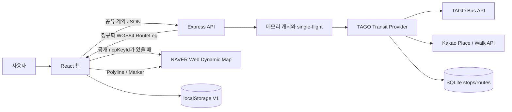

# CHIMap 아키텍처

## 목표와 경계

CHIMap은 React 웹과 Express BFF 구조다. Kakao는 장소·도보, TAGO는 버스
정류장·노선·도착·차량을 제공한다. 브라우저는 두 서버 인증키나 원시 외부
응답에 접근하지 않는다. NAVER Web Dynamic Map은 지도 타일과 overlay를
담당한다.

## 워크스페이스

| 영역 | 책임 |
| --- | --- |
| `packages/contracts` | 좌표, 장소, 정규화 경로, 추천 요청·응답, 오류, 저장 형식의 Zod 스키마 |
| `apps/api/src/providers` | Kakao 장소/도보와 TAGO 버스 후보를 조합하는 `MobilityProvider` |
| `apps/api/src/transit` | TAGO client, SQLite repository, CSV importer, 버스 경로 탐색 |
| `apps/api/src/services` | 캐시, 후보 생성, 계산, 중복 제거, 추천 선택 |
| `apps/api/src/app.ts` | HTTP 보안, rate limit, 검증, request ID, 오류 계약 |
| `apps/web/src/lib` | API 클라이언트, KST 변환, 안전한 브라우저 저장소 |
| `apps/web/src/components` | 장소 combobox, 목표 폼, 카드, 지도, 텍스트 경로 |
| `apps/web/src/store` | 한 화면의 여행 조건과 선택 상태 |

## 요청 흐름

1. 웹 장소 입력은 300ms debounce 후 `/api/v1/places`를 호출한다. TanStack
   Query의 `AbortSignal`로 오래된 검색을 취소한다.
2. 사용자가 목표를 제출하면 웹과 API가 같은 Zod 계약으로 입력을 검증한다.
3. API는 가장 빠른 기본 대중교통 경로를 얻고, 마지막 대중교통 구간의 이전
   정류장 또는 목적지 주변 POI를 운동 후보로 확장한다.
4. 후보를 마감시간·안전 여유·추가시간으로 필터링한 뒤 FAST, BALANCED,
   GOAL을 최대 3개 반환한다.
5. 웹은 카드와 모드별 경로선을 NAVER Polyline/Marker로 표시한다. NAVER
   SDK 키가 없거나 로드에 실패하면 같은 TAGO 정규화 좌표로 SVG 경로와
   텍스트 이동 단계를 유지한다.

첫 세션 진입에는 오렌지 경로선 드로잉, CHIMap 워드마크, 화면 커튼 리빌을
3초 동안 표시한다. 스킵 버튼을 제공하고, 세션 내 반복 방문과
`prefers-reduced-motion` 환경에서는 자동으로 생략한다.

## 계약과 정규화

외부 데이터는 `unknown`으로 받은 뒤 provider 경계에서 Zod로 파싱한다. 이후
애플리케이션은 `NormalizedRoute`만 사용한다.

- 좌표: WGS84 `{lng, lat}`
- 이동 모드: `BUS | SUBWAY | WALK`
- 선택 필드: 요금과 path는 누락 가능
- 각 leg: 거리, 시간, 좌표, 안내, 운동 구간 여부
- API 오류: 코드, 메시지, request ID, 선택적 field errors

이 구조 때문에 TAGO 필드 변화는 client/정규화 계약 테스트에서 감지되고,
버스 후보도 기존 추천 엔진을 그대로 사용한다.

## 지도와 경로의 독립 생명주기

| 경계 | 책임 | 실패 시 |
|---|---|---|
| Kakao REST provider | 장소, 도보 WGS84 경로 | 해당 장소/도보 요청 오류 |
| TAGO provider | 버스 정류장, 노선, 도착, 차량 | 오류 또는 명시적 부분/예상 상태 |
| NAVER Web Dynamic Map | basemap, 줌/이동, Polyline/Marker | SVG 미리보기로 전환 |
| CHIMap 공개 계약 | `{lng,lat}`, `RouteLeg`, `Recommendation` | Zod 검증 실패 |

`RecommendationResponse.mode`는 live/test fixture 모드다. NAVER 지도
준비 상태는 브라우저 로컬 상태이므로 API나 localStorage에 저장하지 않는다.
웹은 Kakao JavaScript 지도 SDK를 로드하지 않으며 API는 NAVER Directions를
호출하지 않는다.

## 상태와 저장

정적 버스 데이터만 SQLite에 저장한다. 실시간 캐시는 재시작 시 사라진다.

| 상태 | 위치 | 수명 |
| --- | --- | --- |
| 현재 폼과 선택 경로 | Zustand 메모리 | 탭 수명 |
| 목표·보폭·마지막 장소 | `chimap:preferences` V1 | 브라우저 저장소 |
| 마지막 선택 요약 | `chimap:last-trip` V1 | 브라우저 저장소 |
| 장소·경로 캐시 | API LRU 메모리 | 프로세스 수명 |
| 전국 정류장·route-stop | SQLite | import/sync 갱신까지 |

저장값은 읽고 쓸 때 모두 Zod로 검증한다. 손상되거나 이전 형식인 값은 앱을
깨뜨리지 않고 무시한다. 위치 이력이나 전체 요청 본문은 서버에 저장하지
않는다.

## 캐시와 호출 제어

- `CachedMobilityProvider`: 장소 1시간, 완성 transit 후보 90초, Kakao 도보
  30분
- `TransitService`: 주변 정류장 5분, 노선/경유정류장 24시간, 도착 20초,
  차량 위치 10초
- 후보 생성의 정류장명→Kakao 장소 해석: 이름·목적지·경로 서명 기준 6시간
- API LRU 기본 상한: 128MiB, 정류장 해석 전용 cache는 16MiB
- 동일 cache miss: single-flight로 한 번만 upstream 호출
- 한 추천: 대중교통 최대 5회, 도보 최대 4회, 합계 최대 9회
- 후보 관련 동시성: 최대 3
- 전체 추천 상한: 15초

메모리 캐시는 한 인스턴스에서만 공유된다. 여러 Cloud Run 인스턴스 사이의
공유 캐시는 MVP 범위 밖이다.

## 보안과 장애 격리

- Helmet 기본 보안 헤더
- 정확히 한 `WEB_ORIGIN`만 허용하는 CORS
- JSON 본문 32KB 상한
- 장소 60회/분, 추천 10회/분 rate limit
- REST 키는 서버 환경변수에만 존재
- NAVER Maps Client ID만 브라우저 빌드에 포함하고 Client Secret은 사용하지 않음
- 구조화 로그 allowlist: 이벤트, request ID, 메서드, path, 상태, 시간,
  후보·호출 개수
- 429/502/503/504 또는 네트워크 실패만 한 번 재시도
- 장소 3초, 경로 5초 timeout
- 일부 운동 후보가 실패하면 성공 후보와 warning을 함께 반환
- SIGTERM/SIGINT에서 새 연결을 닫고 최대 10초 안에 종료

## 구현·배포 상태 경계

2026-07-24 저장소에는 위 구조가 구현되어 있지만 공개 주소의 실행 이미지는
그보다 이전 버전이다. `https://chimap.madcamp-kaist.org`는 Cloudflare
Tunnel을 통해 `127.0.0.1:3000`의
`chimap:naver-stable-20260724` 컨테이너에 연결되어 있고 health는
`mode=mock`을 반환한다. 공개 번들의 NAVER Client ID는 루트 `.env` 값과
일치하지만 SDK 200 이후 인증 endpoint가 401을 반환한다. `MapView`는 이
경우 앱을 중단하지 않고 SVG fallback과 재시도 UI를 유지한다.

현재 소스를 운영 이미지로 승격하려면 TAGO 키, 영속 SQLite volume, 전국
정류장 import, 대표 노선 sync와 live smoke를 먼저 완료해야 한다. 공개 HTTPS는
Cloudflare edge가 종료한다. 원본에는 Certbot으로 발급·dry-run 검증한 Let's
Encrypt 인증서가 있으나, 현재 Tunnel의 `http://127.0.0.1:3000` 연결에서는
사용되지 않는다. 자세한 절차와 검증 상태는 `deployment.md`를 단일 기준으로
삼는다.

## 확장 지점

`MobilityProvider` 구현을 추가하면 추천 엔진 변경 없이 다른 교통 공급자를
붙일 수 있다. 서버 영속화가 필요해지면 `db_schema.md`의 사용자·선호·여행
스냅샷 모델을 기반으로 별도 repository 계층을 추가한다. 인증, 실제 걸음
센서, 공유 캐시, 과금 보호 장치는 다음 단계다.
